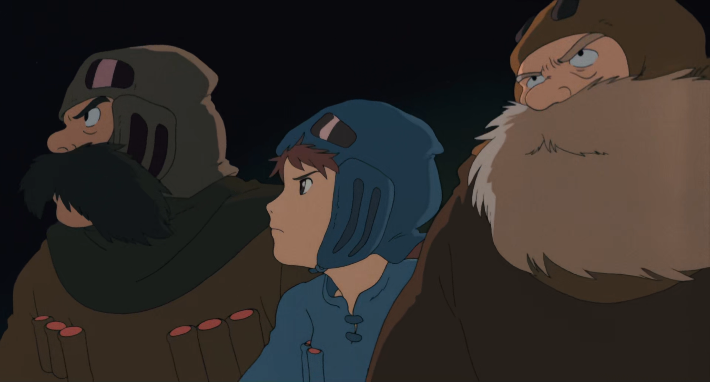
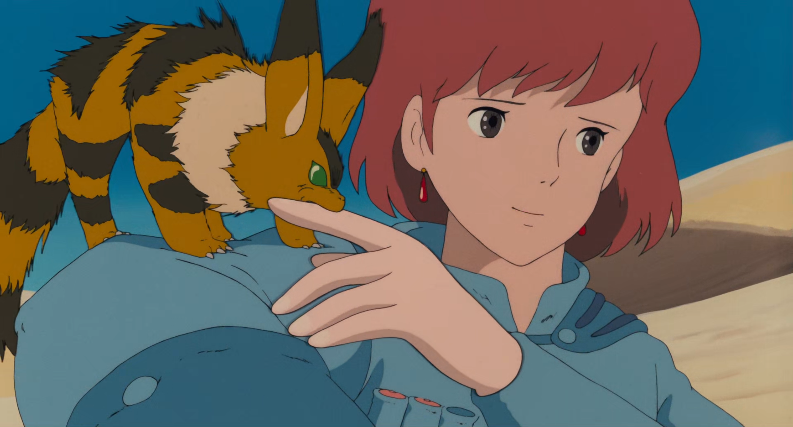
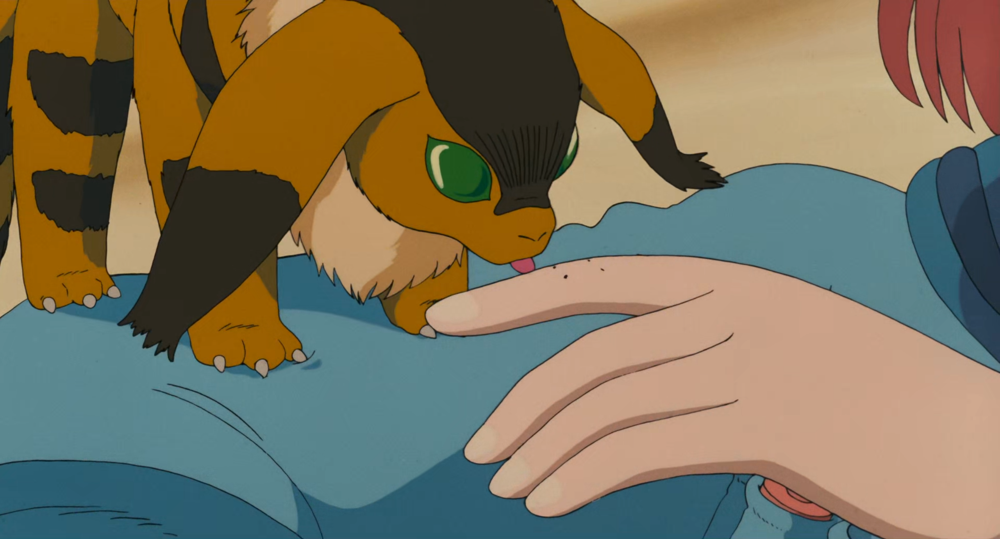
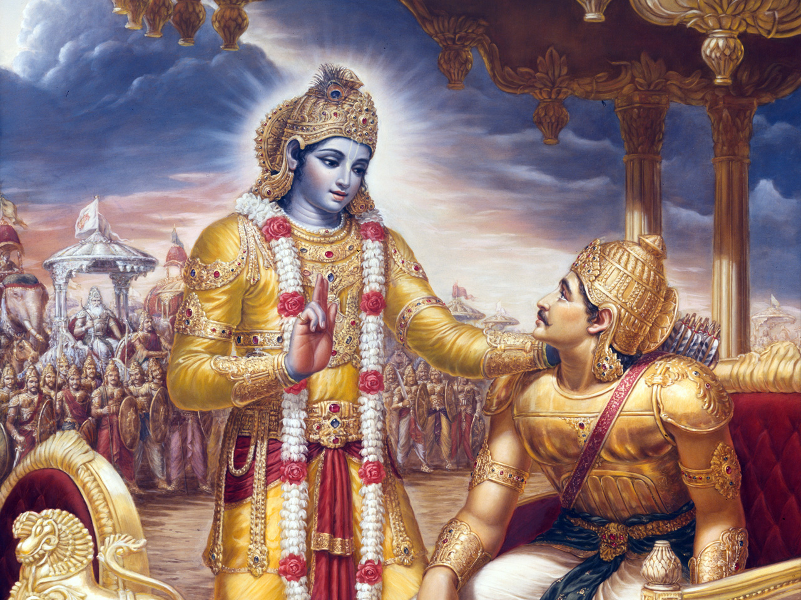

# On Being Human

I was watching _Nausicaa of the Valley of the Wind_ the other day. It's one of Miyazaki's first films (released in 1984), and it's still frequently lauded as one of the best animated films ever made. I actually thought it was kind of boring... but that's beside the point.

When's the last time you saw someone being brave?

To be brave, you have to know pain is coming, and still face it anyway. And there are only two reasons people will do that. Out of fear (because they can't avoid it), or out of love (because they know it's worth it).

"See? Nothing to fear."

Nausicaa is the quintessential idealist: She probably risks her life about 50 times over the course of the movie, and with so little self-concern that it's almost comical. Watching it, I caught myself thinking: "Man, if only anyone was like this in real life".

But actually, some people _are_ like that in real life. So the real question: "Why aren't _I_ like this in real life?"

Because: It's scary.

___

A few years ago, I saw a tweet that was simply:

"If you're so smart, why aren't you happy?"

Upon reading it, I quickly realized a couple of things:

1. I was not happy
2. As a former gifted kid, I was affronted

I was smart (or so I thought), I was trying my best, yet consistent happiness was nowhere to be found. Wtf life?!?

In theory, being happy should be simple. It's pretty consistently correlated with making healthier choices, feeling close with other people, and spending time doing meaningful work.

So why not just do those things?

For starters: Life is unfair. At any time, misfortune can strike: Financial troubles, abusive relationships, health issues, etc.. And even when conditions _do_ seem satisfactory (healthy finances, healthy relationships, free time and physical well-being), many people still consistently fail to live up to their aspirations (see: me).

So again, why? And more importantly, what's to be done?

This may be obvious to some people, but not to others, so: Everyone is different and everyone has different mountains to climb, so no advice is universal.

But I can say: My mountain is fear. And that fear has blocked me from feeling love, which is the _real_ precursor to happiness.

Loving yourself naturally leads to non-coercive healthy choices, love for other people is what makes relationships close, and love for the world is the fuel for doing meaningful work.

So this series of posts, while originally planned to be a survey of Buddhism and ontology, can also be read as a documentary, surveying one man's internal battlefield of fear and love.

"Only the fortunate warriors, O Arjuna, get such an opportunity for an unsought war that is like an open door to heaven." - Krishna, _The Bhagavad Gita_

## Two Kinds of Intelligence

From _The Essential Rumi_, translated by Coleman Barks:

There are two kinds of intelligence: one acquired,
as a child in school memorizes facts and concepts
from books and from what the teacher says,
collecting information from the traditional sciences
as well as from the new sciences.

With such intelligence you rise in the world.
You get ranked ahead or behind others
in regard to your competence in retaining
information. You stroll with this intelligence
in and out of fields of knowledge, getting always more
marks on your preserving tablets.

There is another kind of tablet, one
already completed and preserved inside you.
A spring overflowing its springbox. A freshness
in the center of the chest. This other intelligence
does not turn yellow or stagnate. It's fluid,
and it doesn't move from outside to inside
through conduits of plumbing-learning.

This second knowing is a fountainhead
from within you, moving out.
