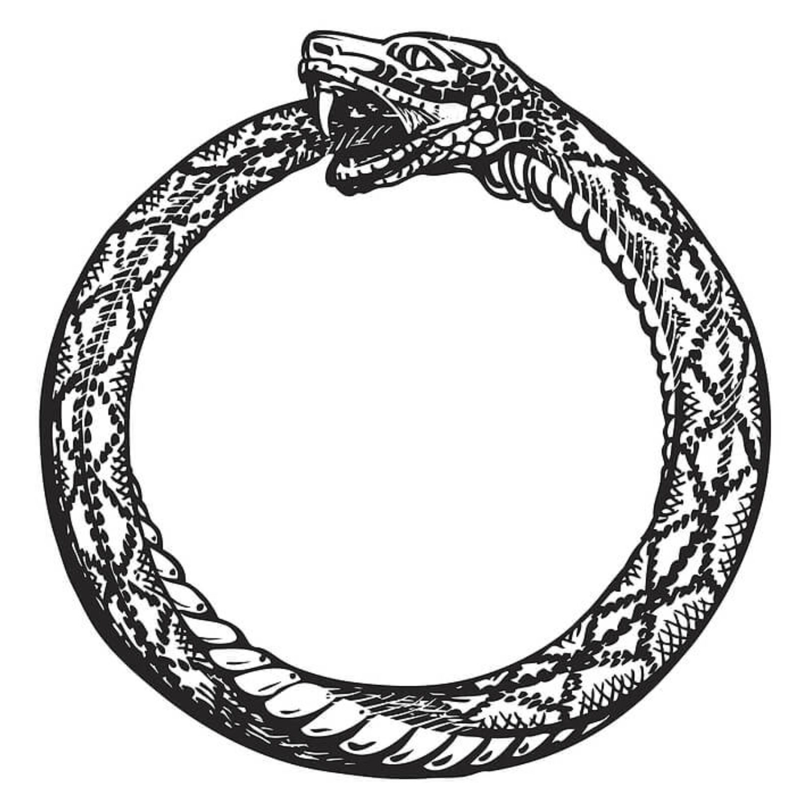

# Buddhism in a Nutshell

I don't like the way most people explain Buddhism. For a bunch of reasons, people tend to avoid explaining the core aspects of the Buddha's teachings all in one place. One reason is that Buddhism is complicated, so simplifying it as I'm doing will inevitably leave out some important details. But another reason is that his teachings can feel like a punch to the gut, and most people who take the time to understand them don't want to instantly turn to their friends and family and punch their guts as well.

But I think his teachings are important, and I want more people to understand and discuss them. So if you don't feel like getting punched in the existential gut, take this as a warning, because I'm winding up a real haymaker.

## Reasonings & Disclaimers

There are endless arguments about who/what/when/where/why/how the Buddha's teachings should be offered. I am not a Buddhist scholar, nor even an "awakened" being, but I _have_ spent the past couple of years learning from books, dharma talks, and opinions of experienced meditators.

Based on my knowledge and my experience thus far, here's how I've decided to present things:

1. English: Do you know Pali or Sanskrit? No? Then let's not add any more indirection into the mix. (If you do know Pali or Sanskrit, you probably know more than what I'm covering anyway)

2. Concept-based: Buddhism, unlike other religions, doesn't involve any supernatural deitites. Instead, the "religion" (which is really better described as a science or practice) is based on concepts that can be directly realized. Explaining those concepts at some level is key to painting an accurate picture of Buddhism as a whole.

3. Goal-oriented: What exactly did the Buddha desire as the end result of practice? How did he teach people to get there?

I have done my best to emphasize only things the Buddha himself actually taught. I'm also intentionally not going to go into arguments against any of his claims here. I want the Buddha's implicit beliefs to come through as clearly as possible, and I explicitly don't want to blunt that impact. Please, _PLEASE_ do not take any of this as meditation advice. Instead, stay tuned for the next parts `:)`

## The Buddha's Story

Date: 5th century BC (~2500 years ago)

Location: The Indo-Gangetic Plain (North India)

Dominant religion: Vedic Brahmanism (precursor to Hinduism). Belief in an individual immortal soul, which is reincarnated continuously until a being releases all of their karma, thus attaining liberation from the cycle and eternal unity with the divine.

The Buddha (given name: Siddhartha Gautama) was born to royalty. The story goes: Siddhartha's parents sheltered him so he wouldn't be exposed to the painful aspects of life. He would rule having never experienced hardship. However, at the young age of 29, Siddhartha finally left the palace and witnessed the suffering of the real world. Specifically, he saw an elderly person, a diseased person, a corpse, and a wandering ascetic.
He realized:

“I am subject to aging, subject to sickness, subject to death, subject to loss. I have not gone beyond aging, sickness, and death." (AN 5.57)

So, understanding his predicament and hoping to find a spiritual path that would allow him to transcend the suffering of his impermanent existence, Siddhartha followed the lead of the wandering ascetic and left his palace for good. He was an extremely precocious student, quickly mastering the teachings of many spiritual traditions, but found that none of them actually provided a refuge from his suffering. He then decided to take matters into his own hands, investigating the nature of his own experience directly to find a way to eliminate suffering for good.

Finally, six years after striking out on his own, Siddhartha reached full enlightenment, earning the title of "The Buddha" ("The Awakened One"). After his enlightenment, his first recorded words were thus:

“Through countless births in the cycle of existence
I have run, not finding
although seeking the builder of this house;
and again and again I faced the suffering of new birth.
Oh housebuilder! Now you are seen.
You shall not build a house again for me.
All your beams are broken,
the ridgepole is shattered.
The mind has become freed from conditioning:
the end of craving has been reached.” (Dhp 153-154)

And if you're curious, these were his last words:

"Behold, O monks, this is my advice to you. All conditions are impermanent. Work hard to gain salvation." (DN 16 6.7.1)

If it's not clear already, the Buddha's view on life was not exactly happy-go-lucky. From the get-go, he was dead-set on his vision, and he never deviated from it. The Buddha was known to say:

“All I teach is suffering and the end of suffering." (SN 22.86)

## The Four Noble Truths

You may have heard the Four Noble Truths before. They are the core teachings of Buddhism, and they go as follows:

1. Suffering is inherent in human life: Physical pain, emotional distress, aging, and death are inevitable.

2. Suffering has a cause. Namely: Craving and aversion, which arise due to ignorance of the true nature of reality.

3. It is possible to reach the end of suffering: Craving and aversion can be abandoned through a deep understanding of reality.

4. The path to ending suffering is the Noble Eightfold Path: Right understanding, intention, speech, action, livelihood, effort, mindfulness, and concentration.

Before we go any further, let's get one thing straight:

## Specifically, What is Suffering?

The Four Noble Truths state that suffering is caused by "craving and aversion", but it may not be immediately clear how or why that's the case.

The first (and most important) piece of the puzzle comes from the phenomenology of suffering. What _is_ suffering made of?

The Buddha realized that the feeling of suffering is the mental motion of "clinging". Our innate tendency to desire good feelings (craving) and avoid bad ones (aversion) manifests as a sub-second contraction in our minds that has the texture of suffering. This "clinging" contraction happens near-instantaneously after good or bad feelings, but is actually a separate phenomenon.

The Buddha describes this pattern with an analogy of "two arrows". The first arrow is the initial appearance of the good or bad thing: Being struck by it is out of your control. The second arrow is the reactivity _to_ the phenomenon: The one you jam into yourself without even realizing you're doing it. And as it turns out, the emotion and story of the second arrow causes _way_ more suffering than the initial strike. This makes sense if you imagine something like working out -- The pain you feel during an intense workout would have you calling the emergency room if it happened while you were sitting quietly at home, but in the context of a workout it feels totally fine, even satisfying. Reacting according to the situation is expected (and usually a good thing), but the point remains that the first arrow doesn't necessitate the second.

So to put it simply: Suffering is just clinging in response to phenomena. And the Buddha says that if we clear up our ignorance about the reality of phenomena, we won't cling at all.

Now that leaves us with the question: What is this "true" nature of reality that us plebians are blind to?

## Concept Time: The Theory of Buddhism

Buddhism is a pretty intellectual endeavor; it really can't be avoided. I've tried my best to explain it below with plenty of analogies, but if abstract concepts aren't to your taste, feel free to skip ahead.

### The Middle Way

"Existence isn't real, but it isn't _not_ real either. 😏"

In Buddhism, the nature of reality is explained by The Middle Way. The Middle Way is both a way of living (avoiding extremes of self-gratification and self-mortification) and a way of looking (seeing neither existence nor nonexistence as real).

How does The Middle Way result in the end of clinging? Imagine this: You're walking, and suddenly you see a snake two feet in front of you. You startle because you think it's real, but it turns out it was actually just the end of a hose. Whew, what a relief. The Middle Way is basically that, but for _everything_. And with the right practice, seeing this not-quite-reality of things isn't just faith-based, it's experiential. So basically, through Buddhism, you gain the power to turn snakes into hoses. Exciting.

#### What is this Middle Way even based on?

The Middle Way is justified by the concept of Emptiness. Specifically, the emptiness of all phenomena.

In this case, Emptiness does _not_ mean "nothingness"; it's not claiming that nothing exists. Instead, it's claiming that things don't exist in the way we naturally believe they do. And despite the name, it's also not endorsing nihilism. In addition to disavowing both existence and nonexistence, the Buddha condemned the stances of both nihilism and eternalism (that things are either totally meaningless, or totally meaningful, respectively).

#### So what actually _is_ Emptiness, then?

When something is "empty", it is empty of "inherent existence": It doesn't actually exist in any real, independent way. It's helpful to think of "empty" as an adjective. But in this case, an adjective that applies to literally everything that exists: Physical objects, thoughts, and even consciousness itself.

For instance, imagine a can of soda. "Soda" is really just a label that we give to mixtures of carbonated water, sugar, and flavorings. So "soda" itself is empty. And that carbonated water is just a label for a mixture of water and oxygen molecules, so it's empty too! And molecules are just labels for groupings of atoms, and so on and so forth.

So, according to Emptiness: "Things" are really just labels that point to groups of smaller things happening together (all of which are empty too). This differs from our natural method of interpreting phenomena, in which we perceive phenomena, instantly unconsciously label it, and conceive of that label as an inherently existing "thing".

#### How does this all relate to The Middle Way?

The Middle Way states that reality neither exists nor doesn't exist, and Emptiness shows that things don't inherently exist. So Emptiness itself implies the Middle Way.

#### "It" "Is" "Soup"

Is it really soup?

Emptiness also applies to the existence of "things" over time: Say we have a bowl of hot broth with white meat and pasta in it. We think "this is chicken soup". And it's still soup when you spoon it into your mouth, but then maybe it's not quite soup because there's some saliva mixed in, and then when you swallow it the chicken isn't quite "in" the broth anymore, and everything is mashed up. So is it not soup anymore? And when it's in your stomach, when does the white meat stop being "chicken" and start being "you"? If you keep going deeper, the boundaries between independent "things" start to dissolve.

So it turns out that our natural inclination to label things is a lot less about reality, and a lot more about usefully categorizing things. If we want to understand reality beyond the labels, the Buddha is ready with an explanation.

### Because This Is, That Is

The teaching of Dependent Origination states that all phenomena are interconnected, only arising dependent on an inconceivably complex web of prior causes and conditions. Therefore, all "things" are both empty (non-inherent) and dependently originating (caused by something else). Additionally, the concept of Interdependent Co-Arising states that not only are all things dependent upon other things, but cause and effect necessarily arise together. The teaching of this concept generally goes as follows:

"With this as condition,
That arises.
With this NOT as condition,
That does NOT arise." (SN 12.61 5.1)

At first, these ideas may seem obvious, or at the very least unimportant. Of course things cause other things. But let's put some pieces together:

1. Nothing in our experience is fundamental. Put another way, there is no root cause that isn't also an effect of some other cause. It's all interconnected and cyclic. Imagine experience as an Ouroboros (a snake eating its own tail). Experience is digesting itself because there's nothing but itself to subsist on. This act feels both good (tasty tail) and bad (ouch my tail).

2. Earlier, I mentioned that suffering is just clinging in response to phenomena, but actually that's only the second arrow. On a deeper level, the Buddha believed that _all_ phenomena lead to suffering. The Ouroboros analogy explains it well: Good things aren't good in a vacuum; eventually the digester will become the digested. Thus, the only way to truly be free of suffering is to prevent phenomena from arising at all.

3. Every phenomenon has a specific set of causes that are conditions for it to arise. If we can remove even one of the causes, the effect will no longer arise. In our Ouroboros analogy, if we can take the tail out of the snake's mouth, it'll stop eating itself. And this is where everything comes together nicely: It turns out that clinging is _also_ the weakest link in the dependently originating cycle of arisings and passings away. Meaning: If you are able to relax your clinging to phenomena enough, they no longer arise at all.

### Cessation

At this point, we have enough context to describe how a person would experientially reach an understanding of the Buddha's teachings. And that experience is, paradoxically, the cessation of experience.

I think it's useful to describe cessation as an operating system update for the mind. The mind, while awareness is still running, "reboots". By witnessing how it builds experience from the ground up, the mind understands itself better, and is thus able to operate more efficiently in the future.

So step by step:

1. You cease all clinging (if only for a moment). This breaks the cycle of Dependent Origination, causing the mind to "reset".

2. By maintaining awareness while Dependent Origination "shuts down" and "powers on" again, you witness the fabrication of phenomena in real time, thereby understanding their Emptiness.

3. By understanding the Emptiness of all phenomena, you know that they are neither real nor not real, resulting in an "OS Update" of a new ontology: The Middle Way.

4. Snakes are now a bit more hose-like (see the last paragraph of [The Middle Way](#the-middle-way) for context). Hooray!

Sounds easy enough. Why don't you try it now? Go ahead, just cease all clinging.

...

Didn't work? Well, just our luck: The Buddha also devised some practical strategies to help people with their tiresome clinging.

## A Path of Practice

The Buddha understood that humans don't naturally have the capacity to instantaneously let go of their attachments to literally everything. People have two main roadblocks:

1. People don't feel comfortable letting go. They fear that they won't be safe or happy without their normal attachments.
2. People don't even know _how_ they're clinging. Their unconcsious attachments are so strong and habitual that they don't even realize they're there.

As usual, the studious Buddha came up with solutions for both of these issues.

### Becoming Wholesome

The Buddha put a massive amount of emphasis on the importance of cultivating wholesome qualities. The Noble Eightfold path (the last of the Four Noble Truths) is basically just a guide for acting ethically and with love. He specifically focused on four types of love:

- Kindness: Love for all beings
- Joy: Happiness about good things
- Compassion: Care directed towards suffering
- Equanimity: Peace in the face of everything

In day-to-day life, the Buddha recommended practicing generosity at every opportunity. In a sense, generosity is the essence of the whole path, since it's literally the act of letting go (of time, money, emotions, etc.) with loving intent.

It _is_ a bit funny (but not contradictory) how the Buddha preached generosity while living on alms.

And in meditation, the Buddha recommended eight states of meditative collectedness and bliss he called the "Jhanas". There are four "form" Jhanas, in which you can still sense your body, but in which the entire felt sense of the body becomes unified. In that unified sensation, each Jhana has a prominent factor:

- 1st Jhana: Pleasure
- 2nd Jhana: Happiness
- 3rd Jhana: Contentment
- 4th Jhana: Peace

The last four Jhanas are the "formless" Jhanas, in which the sense of the body disappears. They are typically described as "realms" or "dimensions" of being. They are:

- 5th Jhana: The realm of infinite space
- 6th Jhana: The realm of infinite consciousness
- 7th Jhana: The realm of nothingness
- 8th Jhana: The realm of neither perception nor non-perception

By spending a lot of time working with the Jhanas, meditators can learn how to access abundant bliss independently of their external conditions. To people who aren't familiar with these states, even the possibility of their existence may sound crazy, but equally so is the Buddha's second thrust of practice, which is characterized by...

### The Five Aggregates and The Three Characteristics

Seems like the Buddha really liked listicles. That, _or_ maybe it was just easier to remember teachings this way back before everything was recorded or written down. In any case, this next set of groups aren't conceptual teachings so much as they are ways of looking at experience. These ways of looking are intentionally designed to undermine our habitual tendencies of clinging, and so lead to awakening.

#### The Five Aggregates

The Buddha encouraged practitioners to view all of experience as a combination of five "aggregates" (types) of phenomena.

1. Form: Physical sensations; the 5 senses
2. Feeling: The "tone" of sensation; whether something is pleasant or unpleasant
3. Perception: Recognition of sensory objects; automatic/subconscious labelling
4. Mental Formations: Thoughts, emotions, beliefs, stories
5. Consciousness: Awareness, presence

By dividing experience into buckets, it's easier to see that every possible "thing" you can recognize falls into one of those buckets. This makes staying "awake" to phenomena (via meditation) simpler.

For example, if you feel a pain in your knee, you would normally be likely to immediately feel the unpleasantness of it, subconsciously label it as "knee pain", and immediately be pulled into a story: Maybe about how you got the injury, how long it will take to heal, or how it's otherwise impacting your life.

"I just wanted to go on a walk..."

Looking in terms of the five aggregates is a strategy to break that automatic narrative cycle. When you feel that pain, you notice the sensation as "Form", the unpleasantness as "Feeling", and so on.

The five aggregates view is also depersonalizing: If things are just "aggregates", there's not much reason to care about them. Likewise, all of the aggregates are impermanent, unable to permanently satisfy us in a way we'd like, and can't be inherently identified as "me" or "mine". The Buddha heavily emphasized these three aspects of phenomena in his teachings, going so far as to proclaim them as...

#### The Three Characteristics

In order to end suffering once and for all, drastic measures must be taken. Specifically, adopting lenses that cast experience in a less-than-appealing light. Or, the Buddha would argue, an accurate light. These lenses are:

1. Impermanence: Everything changes, nothing lasts
2. Unsatisfactoriness (highly contended translation): Phenomena is "a bummer", or "not quite it", or, if you're really hardcore, "suffering"
3. Non-self: No phenomena is "I" or "me" or "mine". That is, there is no agent owning, controlling, or even witnessing phenomena. There is just experience.

Sound a bit... bleak? Maybe this Buddha guy needed a good karaoke night.

... Or maybe he just _really_ wanted people to awaken, at whatever the cost.

There's a quote from him that goes:

"Monks, suppose there was a man whose life span was 100 years, who would live to 100. Someone would say to him, ‘Look here, fellow. They will stab you at dawn with 100 spears, at noon with 100 spears, & again at evening with 100 spears. You, thus stabbed day after day with 300 spears, will have a lifespan of 100 years, will live to be 100, and at the end of 100 years you will realize the four noble truths that you have never realized before.’

"Monks, a person who desired his own true benefit would do well to take up [the offer]... if this were to occur, I tell you that the realization of the four noble truths would not be accompanied by pain & distress. Instead, I tell you, the realization of the four noble truths would be accompanied by pleasure & happiness." (SN 56:35)

Damn. What is this awakening then, and how is it _that_ good?

## The Fruit of Practice

It's nigh impossible to convey the phenomenology of "awakening" accurately with words. Yet it is a very real and distinct phenomenon, so I'll do my best to contour some lines around it.

Technically, in Buddha Dharma, there are four stages of awakening, defined by ten fetters that must each be broken to reach full liberation. The initial stage, known as "stream entry", is what most people are referring to when you hear the word "enlightenment" (which is different than "full enlightenment", which is one of many reasons why "enlightenment" is a dumb term).

### Stream Entry

"Sole dominion over the earth, going to heaven, lordship over all worlds: the fruit of stream-entry excels them." (Dhp 178)

Awakening, stream entry, nonduality, pure being. There are many ways people describe it, but it comes down to one key point:

After lots of practice paying close attention to experience in specific ways, suddenly you see, beyond a shadow of a doubt, that there is no "self", and there never was one.

And it's not that the self is "lost", or "eradicated". Your personality and intelligence and everything about you is still fully intact; it's just that you realize you were adding extra tension onto experience in the shape of a self-conception that didn't actually inherently exist. It was empty, and dependently originated within your own mind (just like everything else).

After releasing the vicegrip of the self, "you" are no longer the one behind your eyes, controlling and receiving experience. Instead, you just experience the unlimited expanse of awareness without a subjective reference point, which is actually exactly how it's always been.

And in knowing that the self is no more than a fictional narrative, craving or aversion lose their power, since there's no "you" to be helped or harmed by any outcome. Suffering: Ended.

But wait, wouldn't that just turn you into an apathetic lump?

Maybe surprisingly, no. Your mind already has existing beliefs and habits in place, so if you have no desire for things to be different than they are, you'll act exactly as you always have! After awakening, experience is technically the same as it has always been, but with the added bonus that you now have a deep okayness with whatever happens.

If that still doesn't sound good: Welcome to why people generally don't introduce Buddhism by talking about its practical goals.

How about an analogy from the Buddha himself? Here he explains stream entry to a monk named Magandiya (MN 75):

___

Magandiya, it is just as if there were a blind man who couldn’t see black objects, white objects, blue, yellow, red objects, the sun or the moon. Now, suppose that a certain man were to take a grimy, oil-stained rag and fool him, saying, “Here, my good man, is a white cloth – beautiful, spotless, and clean.” The blind man would take it and wear it.

Then suppose his friends, companions, and relatives took him to a doctor, and the doctor treated him with medicine, purges from above and purges from below, ointments and counter-ointments and treatments through the nose. And thanks to the medicine his eyesight would appear and grow clear. Then together with the arising of his eyesight, he would abandon whatever passion and delight he felt for that grimy, oil-stained rag. And he would regard that man as an enemy and no friend at all, and think that he deserved to be killed.

“My gosh, how long have I been fooled, cheated, and deceived by that man and his grimy, oil-stained rag. ‘Here, my good man, is a white cloth, beautiful, spotless and clean.’” In the same way, Magandiya, if I were to teach you the Dharma, this freedom from dis-ease, this unbinding, and you on your part were to understand that freedom from dis-ease and see that unbinding, then together with the arising of your eyesight, you would abandon whatever passion and delight you felt with regard for the five aggregates for sustenance.

And it would occur to you, “My gosh, how long have I been fooled, cheated, and deceived by this mind, for in clinging it was just form, it was just body that I was clinging to. It was just feeling, just perception, just mental processes, mental formations, just consciousness that I was clinging to. With my clinging as condition, there is becoming, birth, and then aging and death, sorrow, lamentation, pains, distresses and despairs, all come into play, and thus is the origination of this entire mass of stress.

___

If you're curious to learn more about what awakening entails, here are some external readings/listenings that I've found illuminating:

- [The best explanation I've read](https://www.lesswrong.com/posts/mELQFMi9egPn5EAjK/my-attempt-to-explain-looking-insight-meditation-and) of the mental processes that occur leading to stream entry and why/how things are different afterwards.

- [My favorite descriptive account](https://www.simplytheseen.com/what-is-awakening.html) of the experience of awakening (four pages, navigate at the bottom).

- [A Dharma talk by Rob Burbea](https://hermesamara.org/resources/talk/2008-03-08-awakening) from 2008 on awakening and its place in our modern lives.

After stream entry, assuming a practitioner continues practicing, the stages of awakening continue, freeing the being from more and more of the fetters that bind them to the cycle of existence and nonexistence. Eventually, what is reached is known as "full enlightenment", "neither being nor nonbeing", also referred to as...

### The Unborn, The Deathless, Nirvana

What lies at the end of existence?

...

It is not a dependent origination, and it is not of the five aggregates.

It is not formed by causal conditions, and therefore never changes, nor ceases to exist.

From the Buddha:

“Deep is this Dharma, hard to see, hard to realize, peaceful and refined, beyond the scope of conjecture, subtle, to be experienced by the wise. For those with other views, other practices, other satisfactions, other aims, other teachers, it is difficult to know.” (MN 72 18.1)

"There is that dimension, monks, where there is neither earth, nor water, nor fire, nor wind; neither dimension of the infinitude of space, nor dimension of the infinitude of consciousness, nor dimension of nothingness, nor dimension of neither perception nor non-perception; neither this world, nor the next world, nor sun, nor moon. And there, I say, there is neither coming, nor going, nor staying; neither passing away nor arising. It is without foundation. It continues not. This, just this, is the end of suffering." (UD 8.1)

“Where all phenomena cease, there all ways of speaking cease.” (SN 5.6)
