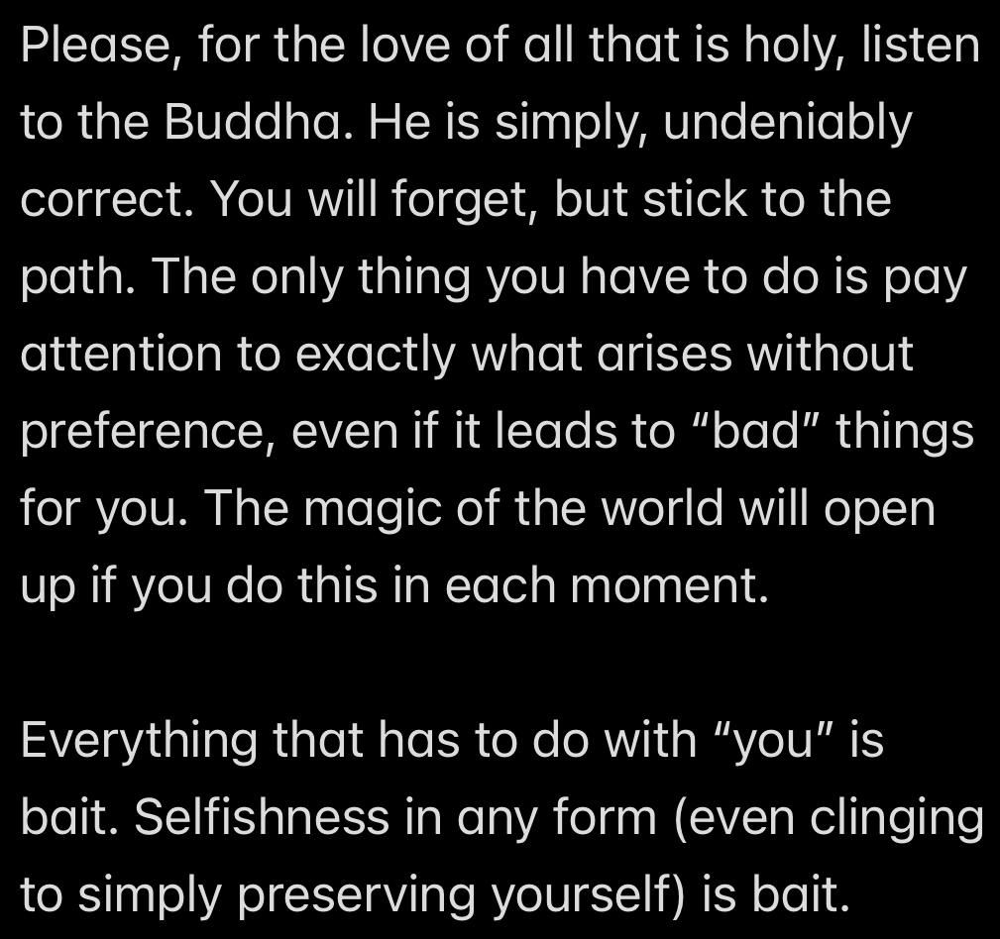

# On Suffering and Desire

Wow Adam, that essay on Buddhism was pretty cool! But unfortunately:

- I don't really get it
- I get it, but it's all bullshit
- I get it, but I hate it
- Why would you waste so much time on this, you poor soul

If any of these are you, then you're not alone: I have felt literally all of these things over the past few years. Yet, from where I stand now, the time I spent digging around The Buddha's rabbithole feels worth it and then some. And now, this post is the culmination of my questions, concerns, investigations, and conclusions.

But first, a content warning: **This post will cover a potentially upsetting ontological viewpoint. Read at your own discretion!**

Burbea meme by [Aaron Nesmith-Beck](https://twitter.com/anesmithbeck/status/1728204114528698845)

## Hold up, can you summarize that last post?

If you didn't read the last post, or didn't fully grok what I was trying to convey, no worries. For the purposes of this essay, there are just a few main points you need to know.

1. The Buddha saw that death was inevitable, and wanted a way to escape that suffering for good
2. The Buddha investigated his own experience and discovered some things:
    - When he experienced suffering, it was actually the mental motion of "clinging".
    - As he relaxed his clinging, experience itself would fade and eventually cut out entirely.
    - Upon fully awakening, he saw that experience is "empty": It only exists dependent on clinging.
    - He also realized that, in fully seeing the emtpiness of experience, he did not cling to it.
3. The Buddha spread his teachings to help other people understand the truth he had awakened to and reach the end of suffering themselves.
4. The goal of this positive reinforcement cycle of relaxing clinging and seeing emptiness is "Nirvana": Permanent freedom from suffering and the cycle of birth, death, and rebirth ("Samsara").

And if you're still wondering what Nirvana is, I don't have a better answer for you. It's not existence, it's not _nonexistence_, it's not both, and it's not neither. It's entirely beyond concepts, but apparently it's pretty good stuff.

## Why am I telling you all of this?

When I first learned about Buddhism, it was very gradual. It took me quite a while to put the pieces together as I attempted to do in my last post. And when you put the pieces together gradually, you'll inevitably have some missing pieces. Engaging with an incomplete picture of Buddhism is like trying to sit on a stool that only has two legs: You _will_ fall over, and it _will_ be undignified.

So I've decided: If I'm going to talk about Buddhism at all, I have to give people a vertical slice:

Image taken from [Visakan Veerasamy's blog](https://medium.com/@visakanv/minimum-viable-content-real-talk-about-content-marketing-and-the-four-mistakes-youll-make-29b3088168fe)

In the previous post, I covered a vertical slice of Buddhism. Now I can talk about what I really want to talk about.

**Final content warning.**

## Was The Buddha Correct?

Here's a question totally out of left field: Have you ever seen the show _Bojack Horseman_? Aside from being one of the most depressing shows of all time, it has some golden insights, such as the following:

**Happiness = Reality - Expectations**

Normally, we feel like the only way to improve our happiness is by changing the reality variable: If we can make the conditions of our lives better, we'll be happier. But the other variable is also just as valid of a lever. If we're able to set our expectations to negative one billion, we'll be happy no matter what reality shapes up to be. Honestly, it's kind of a genius idea.

And of course, the Buddha not only thought of this, but also figured out a consistent way to achieve it.

___

Buddhism, as a practice, is very falsifiable. Over the last two and a half millenia, anyone running the same experiments the Buddha did _could_ have outed him as a fraud, but so far his findings seem to be 100% replicable.

For example: If you meditate deeply enough, you see that the "first arrow" of raw perception is indeed a pointy arrow. It's a known phenomenon in medititation, when in seeing the texture of experience at a microscopic level, people perceive it _literally_ as little bits of suffering. That's exactly what happened to me. And when I saw it, I was sure the Buddha was right. This was the note I left to myself:

So that's it then? The culmination of this whole series is "nuke your expectations of reality into the ground and 'be with what is'"?

It _can_ be the end, if you want it to be.

But what if there's more to it?

## The Buddha and Desire

Remember when I said I didn't have a better answer about what Nirvana was? I was lying `>:)`

Nirvana, translated literally, means "blowing out". In this case, blowing out, or extinguishing, the fires of desire, aversion, and ignorance.

If you recall, craving and aversion are the causes for suffering. But "craving" is really just an unflattering way to say "desire". So it would be accurate to say that "if there is desire, there is suffering". And if we take the (equivalent) contrapositive of that: "If there is no suffering, there is no desire".

In other words, suffering is the price of being able to experience beauty, love, and meaning, paid upfront.

And if you read the Four Noble Truths, it's pretty easy to draw the conclusion that those three things are the root of all suffering. Therefore, the Buddha must think desire is bad... right?

### The Four Bases of Power

(This is the last listicle, I promise)

2500 years ago, transcending life itself was a hot topic in Indian culture. Karma, rebirth, and liberation from Samsara were nothing new. In that culture, the teachings of the Five Aggregates and the Three Characteristics would seem like just another day in the office. Nirvana and Moksha: Pen pals. What I'm trying to get at here is that the Buddha's teachings were a product from and for his time. They grew out of the culture's existing beliefs and encouraged people along the lines of their deepest spiritual desires.

If you don't believe me, maybe you'll believe the Buddha himself. You might already known about the Four Noble Truths, and maybe even the Noble Eightfold Path, but are you aware of The Four Bases of Power? They are:

1. Desire
2. Effort
3. Focus
4. Inquiry

And the Buddha says:

"Whoever develops these four bases of power gives attention to and develops the Eightfold Path [the path to the ending and to liberation. And] whoever neglects these four bases of power neglects the Eightfold Path [neglects the way, forsakes the way to liberation]." (Saṃyutta Nikāya 51:21)

The Buddha noted these qualities specifically with respect to making progress on the path. Meaning: To free yourself from desire, you need desire. So if you don't actually have the desire to follow the Buddha's path, you won't really want to put the effort in, your focus in meditation will be poor, and you won't be curious enough to investigate your experience enough to actually reach any sort of awakening.

Now, knowing that, let's jump forward a couple thousand years, and across the globe.

## Where Buddhism goes Wrong

Here's an excerpt from a talk Rob Burbea gave at a [2008 retreat](https://hermesamara.org/resources/talk/2008-12-28-the-meaning-of-refuge):

> One of my teachers, Ajaan Geoff, said the path is based on a sense of fear, which when I first heard it, I was like, "Wow, that's really odd." Actually to have a very alive sense of danger and fear, it's a requirement for refuge. So the Buddha would encourage these kind of reflections, reflections on ageing, reflections on the fact of sickness, reflections on death, reflections on loss, on the inevitable growing separate from what and who we love. This is the nature of things, and so he said one should reflect, "I am subject to ageing, subject to sickness, subject to death, subject to loss. I have not gone beyond ageing, sickness, death." To really reflect on this. And then to reflect further: "I am not the only one subject to ageing, sickness, death, etc. All beings are subject to ageing, have not gone beyond ageing, sickness, death, loss."

I don't know about you, but reading that doesn't exactly get me fired up to practice.

The Buddha was undeniably a genius. So much so that his original teachings are still potent to this day.

Yet here we are, thousands of years later, and almost every western Buddhist teaching you encounter will gently skip over the dirty bits, like how the Buddha _despised_ phenomena. Want to know how he described the Five Aggregates? “Inconstant, dukkha, a disease, a boil, an arrow, misery, an affliction, alien, a disintegration, empty, not-self” (Aṅguttara Nikāya 9:36). A common western reaction to this sentiment is to recoil: "The Buddha's teachings are anti-life!" And I would have to agree with that. The Buddha was not "against life" per se, but he _was_ against suffering. And since he saw that life was composed of phenomena that are not free of suffering, that was that.

But clearly, the context for receiving his teachings has changed. Is the only answer to feed everyone a watered-down soup of Buddhist pleasantries and ignore the hard bits? Or do we softies just have to buckle down and ride the fear-coaster into the end of existence?

Or maybe... what if the Buddha's teachings _aren't_ the be-all, end-all?

## Nagarjuna

The second-most famous Buddhist teacher, Nagarjuna, lived 500 years after the Buddha. His works tore apart every possible argument supporting the inherent existence of any phenomena, furthering the Buddha's original teachings on emptiness. I won't cover the specifics of his arguments here, but have a gander at his conclusions:

"There exists no distinction at all between Samsara and Nirvana." (Mūlamadhyamakakārikā 25:19)

"Those who do not see reality conceive Samsara and Nirvana; those who see reality conceive neither Samsara and Nirvana." (Yuktisastika)

But wait... the Buddha tended to speak of Nirvana as an "ultimate goal": An end to the Samsaric cycle of rebirth and death. But to treat it as a real goal, one that can be attained in any real way, invalidates his own doctrine of emptiness. Nagarjuna states that, if emptiness is _actually_ observed, even Nirvana will be conceived of as empty (so not to be craved) -- just as empty as the world of phenomena. So where does that leave us?

"Because everything is unconditioned, unproduced, and non-existent... all [phenomena] are the same as enlightenment." (Saptaśatikā Prajñāpāramitā Sūtra)

If everything is empty, then there's really nowhere that has to be reached, nothing that has to be done. And furhtermore, every _view_ is empty. So there's also no need to even reach the _perspective_ of "nowhere to go, nothing to do".

So if it's all empty, what's the point of even doing _any_ of this investigation and practice in the first place?

## Rob Burbea

When there is experience, there is a way of looking at that expereince.

"It's impossible to have a moment of consciousness, a moment of perceiving anything, of experiencing anything, a moment of anything appearing without there being a way of looking. We cannot rest from a way of looking. Actually, not even the Unfabricated, not even a cessation of perception of feeling is really, technically, a rest from a way of looking. Anything we see, sense, anything we sense at all, anything we experience at all, is always experienced through a way of looking." - [Emptiness and Ways of Looking](https://hermesamara.org/resources/talk/2020-02-11-emptiness-and-ways-of-looking)

And as discussed above, experience is made of suffering (dukkha).

"How much of my dukkha right now is coming in relation to there's something I really deeply love, and it's just frustrating not to be there, not to have that opening, not to reach it, but it's in relation to something I deeply love? And how much of my dukkha is actually just a kind of propensity for negative self-view, which could latch itself onto all kinds of things? If I put myself in another situation where we're emphasizing again and again and again something else, that thing gets charged, this practice, that practice, this thing, that thing, and other people around, and then the self gets constructed, as I said before, in relation to that charged thing through repetition, through environment, and then the propensity for the self to get constructed with a negative self-view in relation to that thing -- how much of my dukkha is that kind of dukkha, and how much of my dukkha is the other kind? I don't need to know in percentages, but in terms of practice, it's more like, is it possible at times to focus on the former, on the real, deep desire?

...

So there's a kind of potential alchemy here through the dukkha, but I have to, again, discriminate, discern: which threads am I following here? Desire is hard. It's hard. If I say "yes" to desire, I'm saying "yes" to -- the Buddha's analogy -- a burning coal. Either I throw that burning coal away, or I learn how to relate to it, and I tolerate my burning. And where there's burning, there's beauty, and even blessing, benediction, and gift. But I have to find the right way to let myself be on fire, let that fire burn in me, let that desire move in me, in a way that's actually fruitful. Some of that takes quite fine discernment through the pain." - [True to Your Deepest Desires](https://hermesamara.org/resources/talk/2019-12-26-true-to-your-deepest-desires-talk-and-short-guided-meditation)

If you wanted to, "you" could never have a problem again. The Buddha laid out the path exquisitely. It's been followed before, and you can follow it too.

And, if you wanted, you could achieve eternal perfection; a universe unblemished by suffering of any kind.

But the question is: What is it that you really, most deeply, want?

...

As for myself: I want to touch reality as deeply as possible. Even knowing that I _am_ empty, all of my experiences are empty, and I can't know what will happen after this life ends. Yet right now, by some magic, that emptiness has shaped itself into me. At times I wish it hadn't, and at other times I feel unfathomably blessed that it has. In any case, I'm along for the ride, so I aim to make it as good as possible.

And to get a sense for where I'm headed: Rob Burbea puts it beautifully in the last words of his book, _Seeing that Frees_:

"When there is insight, we know that how and what we see are not simply givens, but are the colourable and malleable, magical, material of empty appearances.

There is space here, and space for reverence and devotion. When we see the void -- the open and groundless nature of all things, the inseparability of appearances and emptiness -- we recognize anyway just how profound is our participation in this magic of appearances. Then whether fabrication, which is empty, is consciously intended in a certain direction or not, the heart bows to the fathomless wonder and beauty of it all. It can be touched by an inexhaustible amazement, touched again and again by blessedness and relief. In knowing fully the thorough voidness of this and that, of then and now, of there and here, this heart opens, over and over in joy, in awe and release. Free itself, it knows the essential freedom in everything."

If you believe it, you can make it real.

You can do it.

## Me

Based on what I've written so far, it might seem like my actual, practical experiences with meditation have been unequivocally terrible. But with the pain of my day of insight... also came this note:

Since that day, I've done my best to move towards those ideals. And now:

What I believe is not really based on any religion. It's just a result of listening to people who seem to be more in touch with life than me, judging them over and over again, putting my judgements aside and listening some more, trying to practice what I've learned, failing, trying some more, failing some more, and then one day, without really realizing how, I'm suddenly doing things less out of fear, and more out of love. And with that love has come a strength to face more suffering head-on, and sometimes even an ability to see it all as worth it.

I really am just passing through this life. None of it is mine; I didn't make it, and I don't get to keep it. Yet I get to experience it nonetheless, and the only way I can repay that is with love. Kindness to everyone I encounter, even though I'll fail. Joy at the magic of it all, even though I'll take it for granted. Compassion to everyone else who still suffers, including myself. And peace, because the space in which all of this is appearing was here before I lived, and will exist after I'm gone.

I am a [Bodhisattva](https://hermesamara.org/resources/talk/2008-02-12-the-birth-of-a-bodhisattva).

"So when there’s that collectedness, integrity of mind, energy, desire, body, at that point there’s
power. I don’t mean power over; I mean power. The being has power. The person has power. And you
can sense it in a person." - Rob Burbea, [Developing Piti, Developing Focus, Developing Wellbeing](https://hermesamara.org/resources/talk/2019-12-21-developing-piti-developing-focus-developing-wellbeing)

___

I've struggled with many things in my life, but if there's one thing that I've had _the_ hardest time accepting, it's this: My actions are always in line with my desires (conscious or not), and the content of those desires is out of my control.

The thing I _want_ to do is based on my personality: I want to look smart. And the thing I _should_ do is mostly based on societal expectations: I should spend time on something that's useful, or impressive, or even just something fun. Instead, right now, what I _will_ do, is the most compassionate thing, which is truest to my deepest desires.

In a universe where to exist is to suffer, that suffering had better be beautiful as fuck.

My friends: I am gay.

## On Giving Love

"You could search the entire universe for someone more deserving of loving-kindness than yourself, and you will not find that person. You will not find that being." (Udāna 5.1)

- Q: Did you _really_ just turn the entirety of existence upside-down and inside-out, _just_ to avoid facing your actual desires?

- A: Yes, and it was very difficult.

- Q: And the whole time, the answer was to just accept that you're a goofy little guy?

- A: Yes.

- Q: Did you do the hokey pokey and turn yourself around?

- A: That's what it's all about.
