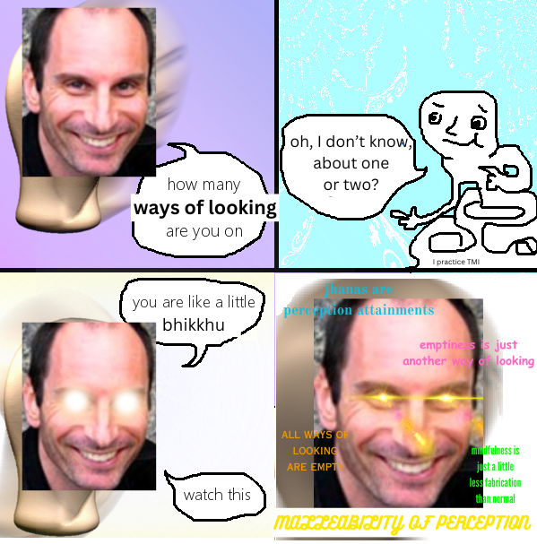
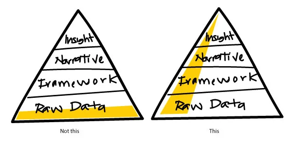
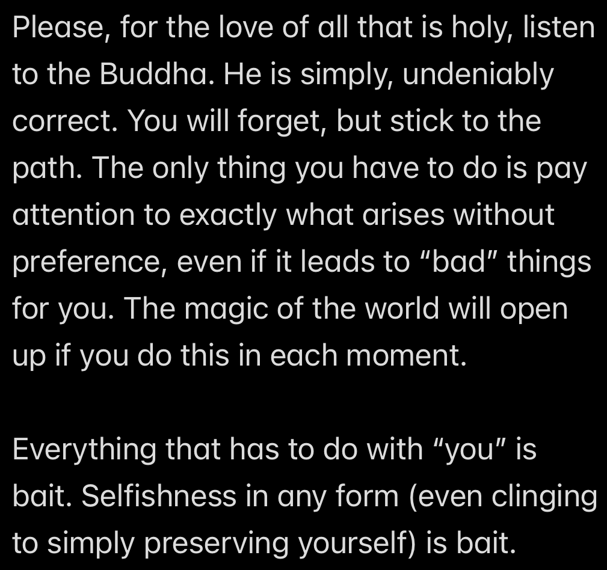
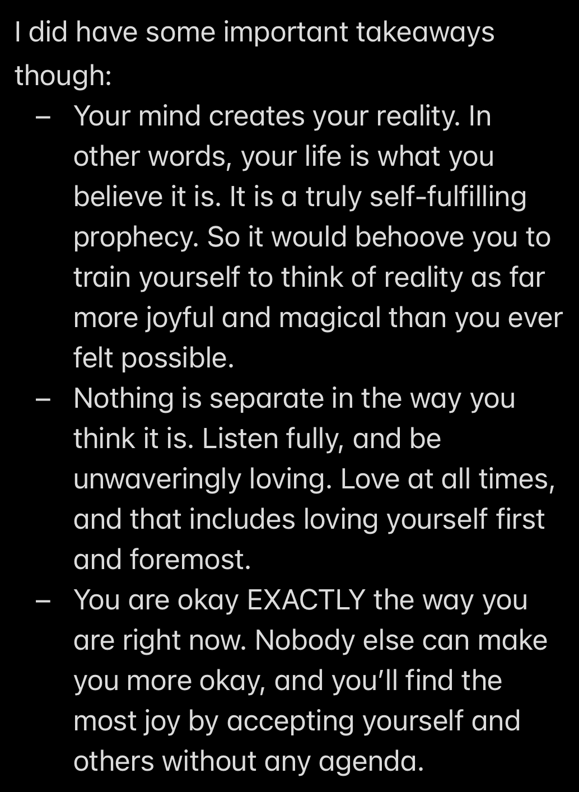
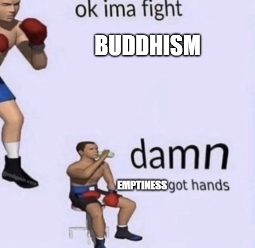
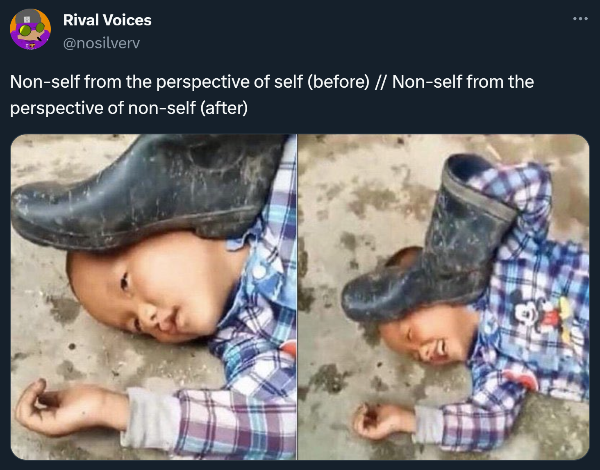

# Battle of the Ontologies

Wow Adam, that essay on Buddhism was pretty cool! But unfortunately:

- I don't really get it
- I get it, but it's all bullshit
- I get it, but I hate it
- Why would you waste so much time on this, you poor soul

If any of these are you, then you're not alone: I have felt literally all of these things over the past few years. Yet, from where I stand now, the time I spent digging around The Buddha's rabbithole feels worth it and then some. And now, this post is the culmination of all of my questions, concerns, investigations, and conclusions.

But first, a _massive_ content warning: **This post will cover some very unsettling ontological viewpoints. Read at your own discretion!**

Burbea meme by [Aaron Nesmith-Beck](https://twitter.com/anesmithbeck/status/1728204114528698845)

## Hold up, can you summarize that last post?

If you didn't read the last post, or didn't fully grok what I was trying to convey, no worries. For the purposes of this essay, there are just a few main points you need to know.

1. The Buddha saw that death was inevitable, and wanted a way to escape that suffering for good
2. The Buddha investigated his own experience and discovered some things:
    - When he experienced suffering, it was actually the mental motion of "clinging".
    - As he relaxed his clinging, experience itself would fade and eventually cut out entirely.
    - Upon fully awakening, he saw that experience is "empty": It only exists dependent on clinging.
    - He also realized that, in fully seeing the emtpiness of experience, he did not cling to it.
3. The Buddha spread his teachings to help other people understand the truth he had awakened to and reach the end of suffering themselves.
4. The goal of this positive reinforcement cycle of relaxing clinging and seeing emptiness is "Nirvana": Permanent freedom from suffering and the cycle of birth, death, and rebirth (Samsara).

And if you're still wondering what Nirvana is, I don't have a better answer for you. It's not existence, it's not _nonexistence_, it's not both, and it's not neither. It's entirely beyond concepts, but apparently it's pretty good stuff.

## Why am I telling you all of this?

When I first learned about Buddhism, it was very gradual. It took me quite a while to put the pieces together as I attempted to do in my last post. And when you put the pieces together gradually, you will inevitably have some missing pieces. Engaging with an incomplete picture of Buddhism is like trying to sit on a stool that only has two legs: You _will_ fall over, and it _will_ be undignified.

So I've decided: If I'm going to talk about Buddhism at all, I have to give people a vertical slice:

Image taken from [Visakan Veerasamy's blog](https://medium.com/@visakanv/minimum-viable-content-real-talk-about-content-marketing-and-the-four-mistakes-youll-make-29b3088168fe)

In the previous post, I covered a vertical slice of Buddhism. Now I can talk about what I really want to talk about.

**Final content warning.**

## Was The Buddha Correct?

Buddhism is very falsifiable. Over the last two and a half millenia, anyone _could_ have run the same experiments the Buddha did and outed him as a fraud, but so far he appears to have been 100% correct about the nature of experience.

But if the Buddha is correct, then experience itself is _literally_ made of little bits of suffering. And a lot of people can not, or will not, accept that, for obvious reasons. But that "first arrow" of perception is indeed an arrow. It's a known phenomenon in medititation, when in seeing the texture of phenomena clearly, people simply cannot handle it. That was exactly what happened to me. And when I saw it, I knew the Buddha was right. This was the note I left to myself:

So that's it then? The culmination of this whole series is just that "life is suffering, so let's escape"?

It _can_ be the end, if you want it to be.

...

There's no option but to go through the bad to get the good.

Remember when I said I didn't have a better answer about what Nirvana was? I was lying `>:)`

Nirvana, translated literally, means "blowing out". In this case, blowing out, or extinguishing, the fires of desire, aversion, and ignorance.

And if you read the Four Noble Truths, it's pretty easy to draw the conclusion that those three things are the root of all suffering. Therefore, the Buddha must think desire is bad... right?

## The Buddha and Desire

2500 years ago, transcending life itself was a hot topic in Indian culture. Karma, rebirth, and liberation from Samsara were nothing new. To them, teachings like The Five Aggregates and The Three Characteristics would seem like just another day in the office. Nirvana and Moksha: Pen pals. What I'm trying to get at here is that the Buddha's teachings were a product from and for his time. They grew out of the culture's existing beliefs and encouraged people along the lines of their deepest spiritual desires.

If you don't believe me, maybe you'll believe the Buddha himself. You might have previously been aware of the Four Noble Truths, and maybe the Noble Eightfold Path, but are you aware of The Four Bases of Power? They are:

1. Desire
2. Effort
3. Focus
4. Inquiry

And the Buddha says:

"Whoever develops [whoever cultivates, whoever gives attention to] these four bases of power gives attention to and develops the eightfold path [the path to the ending and to liberation. And] whoever neglects these four bases of power neglects the eightfold path [neglects the way, forsakes the way to liberation]." (Saṃyutta Nikāya 51:21)

The Buddha noted these qualities specifically with respect to making progress on the path. Meaning: To free yourself from desire, you need desire. So if you don't actually have the desire to follow the Buddha's path, you won't really want to put the effort in, your focus in meditation will be poor, and you won't be curious enough to investigate your experience enough to actually reach any sort of awakening.

Now, knowing that, let's jump forward a couple thousand years, and across the globe.

## Where Buddhism goes Wrong

Here's an excerpt from a talk Rob Burbea gave at a [2008 retreat](https://hermesamara.org/resources/talk/2008-12-28-the-meaning-of-refuge):

> One of my teachers, Ajaan Geoff, said the path is based on a sense of fear, which when I first heard it, I was like, "Wow, that's really odd." Actually to have a very alive sense of danger and fear, it's a requirement for refuge. So the Buddha would encourage these kind of reflections, reflections on ageing, reflections on the fact of sickness, reflections on death, reflections on loss, on the inevitable growing separate from what and who we love. This is the nature of things, and so he said one should reflect, "I am subject to ageing, subject to sickness, subject to death, subject to loss. I have not gone beyond ageing, sickness, death." To really reflect on this. And then to reflect further: "I am not the only one subject to ageing, sickness, death, etc. All beings are subject to ageing, have not gone beyond ageing, sickness, death, loss."

I don't know about you, but reading that doesn't exactly get me fired up to practice.

The Buddha was undeniably a genius. So much so that his original teachings are still potent to this day.

Yet here we are, thousands of years later, and almost every western Buddhist teaching you encounter will gently skip over the dirty bits, like how the Buddha _despised_ phenomena. Want to know how he described the Five Aggregates? “Inconstant, dukkha, a disease, a boil, an arrow, misery, an affliction, alien, a disintegration, empty, not-self” (Aṅguttara Nikāya 9:36). When westerners hear this, their default reaction is to recoil and label the Buddha as being "anti-life". And I can't really disagree with that. The Buddha was not "against life" per se, but he _was_ against suffering. And since life was composed of phenomena that are not free of suffering, that was that.

But clearly, the context for receiving his teachings has changed. Is the only answer to feed everyone a watered-down soup of Buddhist pleasantries and ignore the hard bits? Or do we softies just have to buckle down and ride the fear-coaster into the end of existence?

What if there's another answer?

## Nagarjuna

The second-most famous Buddhist teacher, Nagarjuna, lived 500 years after the Buddha. His works tore apart any possible argument for the inherent existence of any phenomena, furthering the Buddha's original teachings on emptiness. I won't cover the specifics of his arguments here, but have a gander at these quotes:

"There exists no distinction at all between Samsara and Nirvana." (Mūlamadhyamakakārikā 25:19)

"Those who do not see reality conceive Samsara and Nirvana; those who see reality conceive neither Samsara and Nirvana." (Yuktisastika)

"Because everything is unconditioned, unproduced, and non-existent... all [phenomena] are the same as enlightenment." (Saptaśatikā Prajñāpāramitā Sūtra)

But wait... the Buddha tended to speak of Nirvana as an "ultimate goal"; an end to the cycle of rebirth. But to treat it as a real goal, one that can be attained in any real way, invalidates his own doctrine of emptiness. Nagarjuna states that, if emptiness is _actually_ observed, even Nirvana will be seen as just as empty (so not to be craved) as the world of phenomena. So where does that leave us?

If everything is empty, then _any_ view is empty, even the view of emptiness, and any need to reach it.

So if it's all empty, what's the point of even doing _any_ of this investigation and practice in the first place?

## Rob Burbea

When there is experience, there is a way of looking at that expereince.

"It's impossible to have a moment of consciousness, a moment of perceiving anything, of experiencing anything, a moment of anything appearing without there being a way of looking. We cannot rest from a way of looking. Actually, not even the Unfabricated, not even a cessation of perception of feeling is really, technically, a rest from a way of looking. Anything we see, sense, anything we sense at all, anything we experience at all, is always experienced through a way of looking." - Rob Burbea, [Emptiness and Ways of Looking](https://hermesamara.org/resources/talk/2020-02-11-emptiness-and-ways-of-looking)

(Read: Dukkha = Suffering):

"How much of my dukkha right now is coming in relation to there's something I really deeply love, and it's just frustrating not to be there, not to have that opening, not to reach it, but it's in relation to something I deeply love? And how much of my dukkha is actually just a kind of propensity for negative self-view, which could latch itself onto all kinds of things? If I put myself in another situation where we're emphasizing again and again and again something else, that thing gets charged, this practice, that practice, this thing, that thing, and other people around, and then the self gets constructed, as I said before, in relation to that charged thing through repetition, through environment, and then the propensity for the self to get constructed with a negative self-view in relation to that thing -- how much of my dukkha is that kind of dukkha, and how much of my dukkha is the other kind? I don't need to know in percentages, but in terms of practice, it's more like, is it possible at times to focus on the former, on the real, deep desire?

...

So there's a kind of potential alchemy here through the dukkha, but I have to, again, discriminate, discern: which threads am I following here? Desire is hard. It's hard. If I say "yes" to desire, I'm saying "yes" to -- the Buddha's analogy -- a burning coal. Either I throw that burning coal away, or I learn how to relate to it, and I tolerate my burning. And where there's burning, there's beauty, and even blessing, benediction, and gift. But I have to find the right way to let myself be on fire, let that fire burn in me, let that desire move in me, in a way that's actually fruitful. Some of that takes quite fine discernment through the pain." - Rob Burbea, [True to Your Deepest Desires](https://hermesamara.org/resources/talk/2019-12-26-true-to-your-deepest-desires-talk-and-short-guided-meditation)

Instead of seeing "through" the illusion of self, you're seeing "as" not self, which is a way of looking just like seeing "as" the self is. It's not that one is more "real" than the other.

If you want the fullest, deepest, widest, liberation: Ways of looking (Buddha dharma)
If you want to open to the deepest depths of love and desire: Ways of looking (Soulmaking dharma)
If you want the deepest, richest, widest, sense of meaningfulness and beauty: Ways of Looking

What way of looking is happening when those senses are around?
Practicing those ways of looking improves the sense of those things, and opens the possibility of developing those ways of looking further.

At the beginning, _don't_ presuppose the conclusion of emptiness. The goal is not to just know one more thing, and it's not even to "reach" a final way of looking. It's a continuous, experiential and experimental approach to finding what moves life in the directions we find most important.

It's important to be clear on emptiness: Emptiness does not mean that _really_ everything is just a big, empty space, and therefore we should be nihilistic because nothing exists. And Emptiness _also_ doesn't mean that everything is just a process of the five aggregates in time.

Until you have an experienced understanding of emptiness, the conceptual understanding of it should really be of how it functions. That is, via dependent origination. Nothing exists independently of the conditions that brought it about. And applying the Ways of Looking approach teaches us to see how certain conditions (e.g. generosity) result in certain outcomes (more freedom and love). In this way, we learn to see that things are empty, not in the sense that they are nonexistent or meaningless, but that nothing is set in stone.

What the Buddha awakened to was the emptiness of all things. The reason the Buddha taught "suffering and the end of suffering" was because awakening to emptiness _is_ the end of suffering. The way in which we awaken to that can look a billion different ways, but Buddhism, and all of its branches, and anything else that attempts to reach the truth of reality, converge on this point.

But is the end of suffering the point?

If you recall, craving and aversion are the causes for suffering. But "craving" is just a really unflattering way to say "desire". So it would be accurate to say that "if there is desire, there is suffering". And if we take the (equivalent) contrapositive of that: "If there is no suffering, there is no desire".

In other words, suffering is the price of being able to experience beauty, love, and meaning, paid upfront.

In the seeing of emptiness, in _really_ knowing the emptiness of all things, a freedom of the deepest sort is available to us.

If you wanted to, "you" could never have a problem again. The Buddha laid out the path exquisitely. It's been followed before, and you can follow it too.

And, if you wanted, you could achieve eternal perfection; a universe unblemished by suffering of any kind.

But the question is: What is it that you really, most deeply, want?

...

As for myself: I want to touch reality as deeply as possible. Even knowing that I _am_ empty, all of my experiences are empty, and I can't know what will happen after this life ends. Yet right now, by some magic, that emptiness has shaped itself into me. At times I wish it hadn't, and at other times I feel unfathomably blessed that it has.  I'm along for the ride, so I aim to make it as good as possible.

Rob Burbea puts it well in the last words of his book, _Seeing that Frees_:

"When there is insight, we know that how and what we see are not simply givens, but are the colourable and malleable, magical, material of empty appearances.

There is space here, and space for reverence and devotion. When we see the void -- the open and groundless nature of all things, the inseparability of appearances and emptiness -- we recognize anyway just how profound is our participation in this magic of appearances. Then whether fabrication, which is empty, is consciously intended in a certain direction or not, the heart bows to the fathomless wonder and beauty of it all. It can be touched by an inexhaustible amazement, touched again and again by blessedness and relief. In knowing fully the thorough voidness of this and that, of then and now, of there and here, this heart opens, over and over in joy, in awe and release. Free itself, it knows the essential freedom in everything."

**"In the moment, I would have rather suffered a full lifetime's normal suffering rather than have to live with the truth in the frame in which it was presented."** This is a **very** important point; In fact, it's the whole point of this essay.

**Suffering is contingent on the frame, and the frame is malleable.**

## My Theory on "Why" (Religion)

We already defined suffering as "clinging". Anytime there is a duality, your mind is literally "clinging" to maintain the structure of "this" vs. "that". So another word that I think will clarify some things here is "effort". I think this word does a _way_ more helpful job of categorizing phenomena than "suffering". Phenomena is not objectively bad (remember, all ways of looking are empty), but it does take effort to have any perception at all.

And you know another word for effort? Work.

We cannot escape the trappings of the culture we grew up in. If you live in the western world, Christianity is in your bloodstream whether you like it or not. If I rephrase the Buddha's teachings in a more Christan frame, suddenly they become:

1. There is work to be done
2. There is work to be done because you are a sinner
3. It is possible to be free of sin (e.g. John 3:16 "For God so loved the world that he gave his one and only Son, that whoever believes in him shall not perish but have eternal life.")
4. The path to becoming free of sin is to follow the word of Jesus Christ, to do work in God's name

Do I believe this? Not really.

What I believe is not really based on any religion. It's just a result of listening to people who seem to be more in touch with life than me, judging them over and over again, putting my judgements aside and listening some more, trying to practice what I've learned, failing, trying some more, failing some more, and then one day, without really realizing when, I'm suddenly doing things less out of fear, and more out of love. And with that love has come a strength to face more suffering head-on, and sometimes even an ability to see it all as worth it. I am not just this mind, or this body.

I really am just passing through this life. None of it is mine; I didn't make it, and I don't get to keep it. Yet I get to experience it nonetheless, and the only way I can repay that is with love. Kindness to everyone I encounter, even though I'll fail. Joy at the magic of it all, even though I'll take it for granted. Compassion to everyone else who still suffers, including myself. And peace, because the space in which all of this is appearing was here before I lived, and will exist after I'm gone.

I am a [Bodhisattva](https://hermesamara.org/resources/talk/2008-02-12-the-birth-of-a-bodhisattva).

"So when there’s that collectedness, integrity of mind, energy, desire, body, at that point there’s
power. I don’t mean power over; I mean power. The being has power. The person has power. And you
can sense it in a person." - Rob Burbea, [Developing Piti, Developing Focus, Developing Wellbeing](https://hermesamara.org/resources/talk/2019-12-21-developing-piti-developing-focus-developing-wellbeing)

## On Giving Love

"You could search the entire universe for someone more deserving of loving-kindness than yourself, and you will not find that person. You will not find that being." (Ud 5.1)

I probably have a solid 500 hours of meditation experience at this point. I've touched the Dark Night through psychedelics, I understand exactly _what_ I'm supposed to be doing when I meditate, but I've yet to see more than an inch or so of progress in my actual meditative skill. Meanwhile, people I know with less than 50 hours of practice are experiencing states of bliss they never thought possible. So what is it that I'm doing wrong?

I did a 10-day Jhourney Jhana retreat in September of last year. As usual, I made basically no progress over the 30 hours of practice. In interviews, the theme that kept coming up was "control". Due to a variety of factors, my default mechanism to get through life is to handle everything by "managing" it. Socially: Manage people's emotions so nobody feels bad. Financially: Manage my money in a way that won't make me feel bad. Exercise: Do it so I won't feel bad (physically, or mentally, about myself). Meditation: I still don't know if there's a "thing" I'm doing wrong, but the only thing my brain feels safe doing is controlling things.

If I'm really true to my values, my only option is to fight my natural inclination. The thing I want to do is not the most compassionate thing to do. I don't know what the point of life is, but I do know that it's not to arrive safely at death.

## Buddhism vs. Science

**First of all, how do you categorize Buddhism?**

I think this point is really important, so I'm putting it first.

Buddhism, like religion, philosophy, and science, is a mechanism that tries to convey truth. Take a look at this chart:

|                   | Objective Reality      | Subjective Reality |
|-------------------|------------------------|--------------------|
| Claims of Fact    | Religion               | Buddhism           |
| Theories          | Philosophy             | Scienctific Method |

I can forsee a _lot_ of people looking at this chart and saying "wtf?", so let me clarify some definitions.

- Objective Reality: What is true _outside_ of our experience.
- Subjective Reality: What is true _inside_ of our experience.
- Claims of Fact: Beliefs that are treated as objectively true.
- Theories: Beliefs that aren't treated as objectively true.

Now, how each category matches those definitions:

First, religion: Religion makes claims of fact about objective reality. Religion is clearly not presented as a "theory", nor is it used in practice as one. It's faith-based. Religion is treated as a ground truth that can be depended on, and it explains the reality that exists independently of our conception of it.

Next, the scientific method: This one might be strange to some people, since science is supposed to be _the_ most reliable thing we have to determine what is real. And... I would agree with that. But, according to the actual scientific method: Experimental results, even if replicated a million times, are still theories, not "facts" (objective claims). They _could_ be proven false at any time, they just haven't been yet. Science, when done with integrity, is just "what was done" -> "what happened". The "what happened" bit is not some "objective reality" outside of what we experience. The only thing we know about "what happened" is what we saw/heard/felt/smelled/tasted. AKA: What we experienced. AKA: Our subjective reality.

Next, philosophy: Philosophy, like religion, attempts to describe what reality really is, outside of our subjective experience. Unlike religion though, philosophical claims are intended to be purely rational. And since we, as subjective experiencers, can't possibly verify if a philosophical claim about an objective reality outside of our experience is true, philosophical claims must remain as theories.

Finally, we have Buddhism. The reason it's so hard to categorize is because it's not _quite_ a religion and not _quite_ a science. What do I mean by that? Like the scientific method, Buddhism only deals with things in our subjective experience. It says "practice these things and these results happen". But unlike the scientifc method, it doesn't say "these results _have_ happened, but maybe they could be different". The Buddha said "all phenomena _are_ empty". In doing, so he was making an claim of fact about subjective reality.

### Why Buddhism over [insert religion here]?

As mentioned above, Buddhism isn't really a religion; it's apples to oranges. Religion attempts to declare facts about objective reality, whereas Buddhism declares facts about subjective reality. So it's quite possible to be a Christian Buddhist.

### Are science and Buddhism at odds?

Again, there's no overlap between these two where they even _could_ be at odds. Both the scientific method and Buddhism are based on running verifiable experiments on subjective reality and making claims based on their results. Anyone is free to run the Buddha's experiments of meditative inquiry and come up with different results, but that just hasn't happened yet.

There _is_ a difference between the two though. In science, everything is a "theory": As in, the claims should not be treated as objective fact. On the other hand, the Buddha _does_ makes objective claims.

I think the better question, and the one that most people are _really_ asking when they bring up science and objectivity as an argument against Buddhism, is...

### Are Scientific Materialism and Buddhism at odds?

This is where things get spicy.

Scientific materialism is the belief that objective reality is made of matter; the particles that make up our reality are fundamentally real and cause everything else to work the way it does.

It's important to clarify that scientific materialism is _not_ the same thing as the scientific method, and it's not "the results of the scientic method" either. Scientific materialism takes the theories we've come up with based on scientific experiments run on subjective reality, mixed them with subjective intuitions about how reality works, and claims that the amalgamation is objective reality.

In the chart, scientific materialism would fall under the "religion" category because it's claiming a fact about objective reality. In a sense, scientific materialism is the "religion of no religion", and its followers have a "faith in faithlessness".

As with other religions, there's not technically overlap between scientific materialism and Buddhism. It's very possible to be an athiestic Buddhist, for example.

But, since it'd be fun... why don't we try using the concepts of Buddhism to try to explain objective reality?

### Emptiness as Objective

If we look at modern physics, we can almost intuit emptiness without even knowing about Buddhism. Modern quantum mechanics seems to support the things the Buddha said two and a half millenia ago.

Remember, the fundamental concept underlying Buddhism is Emptiness: That things don't have an actual, inherent existence.

Even going back a hundred years, scientific material was already starting to lose it's footing.

Take Werner Heisenbarg. This was a hundred years ago, and physics has only gotten crazier since:

> What is an elementary particle? We say, for instance, simply “a neutron,” but we can
give no well-defined picture of what we mean by the word. We can use several pictures
and describe it once as a particle, once as a wave or as a wave packet. But we know that
none of these descriptions is accurate…. If one wants to give an accurate description of
the elementary particle … the only thing which can be written down is a probability
function [what I just talked about]. But then one sees that not even the quality of being
[that it ‘is’ or ‘is not’], if it may be called a quality, belongs to what is described.

I'm not a physicist though, so maybe my word doesn't count. But how about Niels Bohr, creator of the Bohr model of the atom and major contributor to quantum theory?

> “Everything we call real is made of things that cannot be regarded as real.”

But Bohr was a bit of a philosopher. Maybe, despite his genius, he was also inclined to believe in some outlandish things. How about someone we can _really_ trust: Albert Einstein.

> "Quantum mechanics is certainly imposing. But an inner voice tells me that it is not yet the real thing. The theory says a lot, but does not really bring us any closer to the secret of the old one. I, at any rate, am convinced that He does not throw dice."

### Ontology

> When I was in graduate school, I recall hearing “One starts as a materialist, then one becomes
a dualist, then a panpsychist, and one ends up as an idealist”. I don’t know where this comes from, but I think the idea was something like this. First, one is impressed by the successes of science, endorsing materialism about everything and so about the mind. Second, one is moved by problem of consciousness to see a gap between physics and consciousness, thereby endorsing dualism, where both matter and consciousness are fundamental. Third, one is moved by the inscrutability of matter to realize that science reveals at most the structure of matter and not its underlying nature, and to speculate that this nature may involve consciousness, thereby endorsing panpsychism. Fourth, one comes to think that there is little reason to believe in anything beyond consciousness and that the physical world is wholly constituted by consciousness, thereby endorsing idealism.

- David J. Chalmers

Most of us "pick" our ontologies totally unconsciously. Family, friends, school, and society usually push us into believing whatever would be most accepted by our social circle. And it's unfortunate, since Ontology is totally unverifiable, and yet it has an extremely powerful effect on how we live our lives.

To me, ontology is like one of those memes where you pick one based on totally arbitrary criteria. And so, I've created a "What's your Ontology" picker!

Objective reality (Birth Month)...

- Is exactly what we perceive (Materialism) - January / July
- Is both mind and matter (Dualism) - February / August
- Is made of consciousness (Panpsychism) - March / September
- Doesn't exist (Idealism) - April / October
- _REALLY_ doesn't exist (Buddhism) - May / November
- Is all of the above, infinitely and cyclically - June / December

God...

- Doesn't exist
- Is working through you
- Is punishing you
- Is teaching you
- Is you
- Is many different things
- Is just playing it by ear

And the point of it all...

- Doesn't exist
- Is to fulfill your duty
- Is to enjoy it
- Is to suffer
- Is to create and discover
- Is to love and be loved
- Exists but is unknowable

___

A lot of people _hate_ Buddhism. I know I have at some points. In essence, it's "abandon everything because it's all suffering".

In a world where beliefs are so powerful... Why would anyone pick Buddhism? If you don't believe in scientific materialism, why not find a belief system that _supports_ human desire, or at least supports _anything_? And frankly, how does one even _find_ Buddhism? If you don't like Christianity, why not pick any other random eastern religion? And finally: What are the practical implications of practicing Buddhism? Is it just fancy dissociation? Are its goals realistically attainable?

All of these (and more) will be answered in this post.

## To do your duty as a human

## What exactly _is_ the Buddhist Path?

## Is the end of suffering the most important thing?

## If everything is empty, how _isn't_ that Nihilism?

### Paradoxes

- Emptiness of all particles, what's fundamental? Time? Space?

### Provisional Truths

Einstein didn’t disprove Newtonian mechanics so much as identify it as a special case in a more general framework. Whatever future physics is, its first step will be to recreate the predictive power of the Standard Model

Einstein: “while general relativity might one day be superseded, the statistical theory of atoms will never be overthrown.”

[Romeo Stevens on Christianity vs. Buddhism](https://x.com/RomeoStevens76/status/1739807369171972588?s=20)

### FPS, no grabby-grab

Due to the way suffering works, much of our daily suffering can be directly reduced through meditation. Meditative practice

### Benefits of Buddhism

- Never lonely
- Always feel okay
- Better at modeling other people
- Easy to just do stuff
- Way less fear of death
- Can update your beliefs instantly if you want to
- Never bored

## Is the work required to reach stream entry worth it?

[RivalVoices on ending suffering via Buddhism](https://x.com/nosilverv/status/1742311850836951201?s=20)

Who do you believe? If you believe your unawakened self, then almost definitely no. But I'd advise you to consider Plato's [Allegory of the Cave](https://www.youtube.com/watch?v=69F7GhASOdM).

If you listen to any stream enterer, almost all will say that the shift that occurs was the most important event of their lives, bar none. And most will spend the rest of their lives trying to help other people experience the same.

Whether you personally should make the effort can only be a personal decision. Do you desire to try? And speaking of desire...

This is why it's important to ask...

## What is your actual desire?

[Nick Cammarata: "ah ok I'll save the world, that's special right!"](https://x.com/nickcammarata/status/1741561355264745778?s=20)

If Buddhism appeals to you, I think it's important to deeply inquire into why. And that's not coming from a place of judgement, but a place of practicality. If you do not deeply desire the reason you're actually practicing, you not only won't likely get anywhere, but you may end up in a mental state far worse than you began with.

Here are some reasons I can think people would want to engage directly with Buddhist teachings:

- Something about the teachings is true and beautiful to them; something deep within them loves the Dharma
- They are deeply suffering
- They have a background in religion/spirituality/meditation that doesn't see the claims as antithetical to their current ontology
- They have reached the point in their lives where selflessness has naturally overtaken self-interest as their primary motivator
- They are willing to risk it all to understand the nature of reality (me)

If you don't fall into any of these camps, then what?

## What actually feels good?

- Trying my absolute hardest
- Believing in something
- Feeling connected with other people
- Absurd, goofy, and creative things that are nonetheless impactful
- Adrenaline rushes from running while listening to music
- Working through a complex issue

## What is most important?

- Paying attention to where your attention is, and directing it towards the things you want to see more of

[Rob Burbea on approaching Emptiness](https://hermesamara.org/resources/talk/2011-12-31-this-matter-of-emptiness).

## What other assumptions are buried under this mess?

The absolute best response that I've heard to this whole deal comes from a talk by Rob Burbea from 2014: [Questioning Awakening](https://hermesamara.org/resources/talk/2014-11-12-questioning-awakening). If you have gripes with the way I've addressed (or not addressed) anything here, I can almost guarantee that that this talk will cover them.

"What am I becoming as the days and nights fly past?" (AN 10:48)

“Only put off until tomorrow what you are willing to die having left undone.” - Pablo Picasso

“The only true wisdom is in knowing you know nothing” - Socrates

## Adam's Instructions for Meditation (and Living Well)

### Prerequisites

1. You must love yourself. If you do not love yourself, I recommend Sasha Chapin's [self-acceptance course](https://www.sashachapin.com/self-acceptance-course). If you don't like that idea, then try talking to your friends and family about how they learned to love themselves. I promise you'll get something out of it.
2. You must be able to reside in your body. River Kenna's [somatic resonance course](https://www.riverkenna.com/soma) is designed specifically for that. If you don't like that idea, then I recommend practicing yoga or some other form of exercise or movement where bodily awareness is key.

### Practice

1. Sit down in as comfortable of a position as possible. You should be able to relax _all_ of your muscles and not fall over. If this requires sitting in a chair with a back and armrests, fine. If it requires lying down flat, it's less ideal because it'll be really hard to focus, but also fine.
2. **Important**: Begin with an intention of kindness. You are doing this practice because you love yourself, and because doing the practice will make you feel better. This is not a background, fuzzy thing. Tell your body very clearly: "I am doing this for you" (with love).
3. As you set the intention of kindness, pay attention to how your body reacts. It should relax, and you should be able to place your attention on the feeling of that relaxation.
    - If your body _doesn't_ relax, you aren't loving yourself. Try step 2 again. If you absolutely can't get it to work, go back to step 1 of the prerequisites. This is not optional.
    - If you don't really understand what it means to place your attention on the feeling of relaxation in your body, try imagining what relaxing feels like, and then tune into the "good" feeling of it. If you still aren't clear about how that feels, go back to step 2 of the prerequisites. This is also not optional.
4. Once you have a baseline level of bodily attention, "meditation" begins. The "goal" is to feel as good (read: relaxed) as you possibly can while your attention rests on your body. Don't do anything else. When you get distracted or tense, just notice it when you notice it (you can't control when that happens), and relax your attention back on your body again. The distractions, and I am not just being "nice" here, are literally an important part of the process.
    - If you're new, this is probably a good place to stop, even if you go for 10-20 minutes. A lot of the time, trying too many new things actually has adverse effects.
    - If you constantly get distracted by emotions (frustration, anxiety, guilt) while meditating, you aren't loving yourself. Try step 2 again. If you absolutely can't get it to work, go back to step 1 of the prerequisites. This is not optional.
5. If you're more advanced, or want to try something new, the next step is to take an explicit stance towards the sensations you're paying attention to. Specifically, the stance of "Welcome :)". As sensations in your body arise, notice each one and accept it as much as you possibly can. The reason this is a more advanced technique is because "doing" anything in meditation is counterintuitive. It's very easy to try to welcome everything by paying as MUCH attention to it as possible. If you push your attention directly into sensations saying "YOU ARE A SENSATION. WELCOME TO MY AWARENESS!", your body will _not_ relax, and the meditation will be uncomfortable and annoying. "Welcome :)" is like a feather-light attention; your awareness should gently graze the sensations, sensuously allowing them in to your cozy abode of bodily relaxation. If you can pull this off, "bad" sensations will lose the edge that makes them feel bad.
6. If you're extra advanced, try noticing the shape and size of your field of awareness. When you first start meditating, you might only be able to pay attention to one spot on your body at a time, and that spot might jump around sporadically. But as you progress, you can notice that the feeling of your whole body is already in awarness without having to do anything else. And not only that, but sounds and all of the other senses are there too. And then you might even notice the feeling of "looking" at sensations; a contraction in the back of your head that's always there because you're "paying attention", and you can relax that too. Eventually, your attention will just be equivalent to everything in the field of awareness.

### Bringing Practice into Life

1. Once you're able to regularly tune into your body and make it feel good in meditation, it's time to tune into your body in real life. Your body always knows _what_ to do, and your head always knows _how_ to do it. When it's safe, instead of relying on your head to decide everything, let the body take charge. Isabel from Mind Mine has [a fantastic post](https://mindmine.substack.com/p/head) on this.
2. You'll know when you're actually letting your body call the shots because doing things will feel _good_. Not just physically, but emotionally as well. You'll feel more confident in the things you're saying and doing, which enables you to do fun stuff, like, say, [writing a tweet like this](https://twitter.com/eigenrobot/status/1747448124396757077).
3. When you're embodied, you feel powerful and in control, and this does _magic_ for your well-being. You feel allowed, maybe for the first time ever, to believe the things you secretly want to believe. For example, I'm fond of [Vivid Void's Ontology](https://x.com/VividVoid_/status/1730709020741386708?s=20).

If you're just beginning meditation, I recommend Rob Burbea's retreat on [Unbinding the Heart](https://hermesamara.org/resources/all/retreat/Unbinding%20the%20Heart). Another world awaits.
