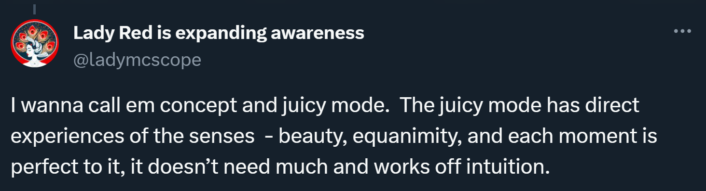

# Sensing with Soul

This document comes entirely from the heart.

Where there is magic, there is love.

## Context

## People I think are doing important work

- Sasha Chapin: [Everything](https://www.sashachapin.com/)
- River Kenna: [Soul](https://twitter.com/the_wilderless)
- Isabel: [Femininity](https://twitter.com/isabelunraveled)
- Eigenrobot: [Masculinity](https://twitter.com/eigenrobot)
- Vivid Void: [Ontology](https://twitter.com/VividVoid_)

## My Collage

[Two Player Competition - Kirby's Avalanche](https://www.youtube.com/watch?v=fdYJBUIi5IQ&t=7s)

## Two Ways of Running

From _The Essential Rumi_, translated by Coleman Barks:

A certain man had a jealous wife
and a very, very appealing maidservant.

The wife was careful not to leave them alone,
ever. For six years they were never left
in a room together.
But then one day
at the public bath the wife suddenly remembered
that she’d left her silver washbasin at home.

“Please, go get the basin,” she told her maid.

The girl jumped to the task, because she knew
that she would finally get to be alone
with the master. She ran joyfully.
She flew,
and desire took them both so quickly
that they didn’t even latch the door.

With great speed they joined each other.
When bodies blend in copulation,
spirits also merge.

Meanwhile, the wife back at the bathhouse,
washing her hair, “What have I done!
I’ve set the cotton-wool on fire!
I’ve put the ram in with the ewe!”

She washed the clay soap off her hair and ran,
fixing her chador about her as she went.

The maid ran for love. The wife ran out of fear
and jealousy. There is a great difference.

The mystic flies moment to moment.
The fearful ascetic drags along month to month.

But also the length of a “day” to a lover
may be fifty thousand years!

You can’t understand this with your mind.
You must burst open!

Fear is nothing to a lover, a tiny piece of thread.
Love is a quality of God. Fear is an attribute
of those who think they serve God, but who are actually
preoccupied with penis and vagina.

You have read in the text where They love him
blends with He loves them.
Those joining loves
are both qualities of God. Fear is not.

What characteristics do God and human beings
have in common? What is the connection between
what lives in time and what lives in eternity?

If I kept talking about love,
a hundred new combinings would happen,
and still I would not say the mystery.

The fearful ascetic runs on foot, along the surface.
Lovers move like lightning and wind.
No contest.
Theologians mumble, rumble-dumble,
necessity and free will,
while lover and beloved
pull themselves
into each other.

The worried wife reaches the door
and opens it.
The maid, disheveled, confused, flushed
unable to speak.
The husband begins his five-times prayer.

The wife enters this agitated scene.
As though experimenting with clothes,
the husband holds up some flaps and edges.

She sees his testicles and penis so wet, semen
still dribbling out, spurts of jism and vaginal juices
drenching the thighs of the maid.
The wife slaps him
on the side of the head,
“Is this the way
a man prays, with his balls?
Does your penis
long for union like this?
Is that why
her legs are so covered with this stuff?”

These are good questions
she’s asking her “ascetic” husband!

People who renounce desires
often turn, suddenly,
into hypocrites!

## Where to now, St. Peter?

[Perfection and Christ's Blessing](https://hermesamara.org/resources/talk/2020-03-06-perfection-and-christs-blessing) - Rob Burbea's final talk

"Courage, however, is the best slayer, courage which attacketh: it slayeth even death itself; for it saith: 'Was that life? Well! Once more!'" - Friedrich Nietzsche
