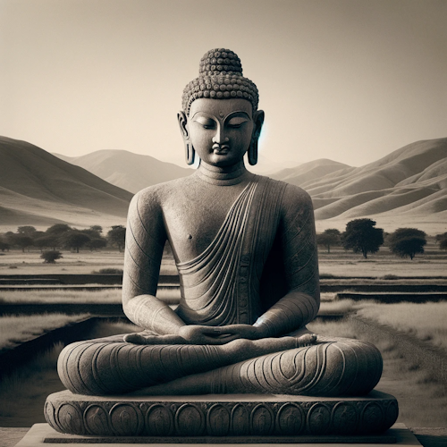

# Buddhism: A Primer

This is the second section of a 4-part series. For context on why I'm writing this, check out [part one](Introduction.md).

I don't like the way most people explain Buddhism. For a bunch of reasons, people tend to avoid explaining the main thrust of the Buddha's teachings all in one place. One reason is that Buddhism is complicated, so simplifying it as I'm doing will inevitably leave out some important details. But I think his teachings are fascinating and I want more people to understand and discuss them, so I'm going to try anyway.

## Reasonings & Disclaimers

There are endless arguments about who/what/when/where/why/how the Buddha's teachings should be offered. I am not a Buddhist scholar, nor even an "awakened" being, but I have spent the past couple of years learning from books, dharma talks, and opinions of experienced meditators.

Based on my knowledge and my experience thus far, here's how I've decided to present things:

1. English: Do you know Pali or Sanskrit? No? Then let's not add any more indirection into the mix. (If you do know Pali or Sanskrit, you probably know more than what I'm covering anyway)

2. Concept-based: Buddhism, unlike other religions, doesn't involve any supernatural deitites. Instead, the "religion" (which is really better described as a science or practice) is based on concepts that can be directly realized. Explaining those concepts at some level is key to painting an accurate picture of Buddhism as a whole.

3. Goal-oriented: What did the Buddha specifically desire as the end result of practice? How did he teach people to get there?

I have done my best to emphasize only things the Buddha himself actually taught. I'm intentionally not going to go into arguments against any of his claims here, and I'm also not going to emphasize the nicer aspects of the Buddha's teachings (e.g. the Jhanas, cultivating love and generosity, etc.). I want the Buddha's implicit beliefs to come through as clearly as possible, and I explicitly don't want to blunt that impact. Please, _PLEASE_ do not take any of this as meditation advice. Instead, stay tuned for the next parts `:)`

## The Buddha's Story

Date: 5th century BC (~2500 years ago)

Location: The Indo-Gangetic Plain (North India)

Dominant religion: Vedic Brahmanism (precursor to Hinduism)

The Buddha (given name: Siddhartha Gautama) was born to royalty. The story goes: Siddhartha's parents sheltered him so he wouldn't be exposed to the painful aspects of life. He would rule having never experienced hardship. However, at the young age of 29, he finally left the palace and witnessed the suffering of the real world. Specifically, he saw an elderly person, a diseased person, a corpse, and a wandering ascetic.
Siddhartha realized:

“I am subject to aging, subject to sickness, subject to death, subject to loss. I have not gone beyond aging, sickness, and death."

So, understanding his predicament and hoping to find a spiritual path that would allow him to transcend the suffering of his impermanent existence, Siddhartha followed the lead of the wandering ascetic and left his palace for good. He was an extremely precocious student, quickly mastering the teachings of many spiritual traditions, but found that none of them actually provided a refuge from his suffering. He then decided to take matters into his own hands, investigating the nature of his own experience directly to find a way to eliminate suffering for good.

Finally, six years after striking out on his own, Siddhartha reached full enlightenment, earning the title of "The Buddha" ("The Awakened One"). After his enlightenment, his first recorded words were thus:

“Through countless births in the cycle of existence
I have run, not finding
although seeking the builder of this house;
and again and again I faced the suffering of new birth.
Oh housebuilder! Now you are seen.
You shall not build a house again for me.
All your beams are broken,
the ridgepole is shattered.
The mind has become freed from conditioning:
the end of craving has been reached.”

And if you're curious, these were his last words:

"Behold, O monks, this is my advice to you. All component things in the world are changeable. They are not lasting. Work hard to gain your own salvation."

If it's not clear already, the Buddha's view on life was not exactly happy-go-lucky. From the get-go, he was dead-set on his vision, and he never deviated from it. The Buddha was known to say:

“I teach one thing and one thing only: Suffering and the end of suffering.”

## Buddhism in a nutshell

### The Four Noble Truths

You may have heard the Four Noble Truths before. They are the core teachings of Buddhism, and they go as follows:

1. Suffering is inherent in human life: Physical pain, emotional distress, aging, and death are inevitable.

2. Suffering has a cause. Namely: Craving and aversion, which arise due to ignorance of the true nature of reality.

3. It is possible to reach the end suffering: Craving and aversion can be abandoned through a deep understanding of reality.

4. The path to ending suffering is the Noble Eightfold Path: Right understanding, intention, speech, action, livelihood, effort, mindfulness, and concentration.

So what is this "true" nature of reality that us plebians are blind to?

### Emptiness and Dependent Origination

#### The Middle Way

Buddhism is most simply explained by The Middle Way. The Middle Way is both a practice, avoiding both extremes of self-gratification and self-mortification, and also a resulting ontology, in which neither existence nor nonexistence is reified.

"Existence isn't real, but it isn't _not_ real either. 😏"

The foundation for The Middle Way is the concept of Emptiness. Specifically, the emptiness of all phenomena.

In this case, Emptiness does _not_ mean "nothingness"; it's not claiming that nothing exists. Instead, it's claiming that things don't exist in the way we naturally believe they do. And despite the name, it's also not endorsing nihilism. The Buddha actually _specifically_ condemned the stances of both nihilism and eternalism.

##### So what actually _is_ Emptiness, then?

When something is "empty", it is empty of "inherent existence": It doesn't actually exist in any real, independent way. It's helpful to think of "empty" as an adjective. But in this case, an adjective that applies to literally everything that exists: Physical objects, thoughts, and even consciousness itself.

For instance, imagine a can of soda. "Soda" is really just a label that we give to mixtures of carbonated water, sugar, and flavorings. So "soda" itself is empty. And that carbonated water is just a label for a mixture of water and oxygen molecules, so it's empty too! And molecules are just labels for groupings of atoms, and so on and so forth.

So, according to Emptiness: "Things" are really just labels that point to groups of smaller things happening together (all of which are empty too). This differs from our natural method of interpreting phenomena, in which we perceive phenomena, instantly unconsciously label it, and conceive of that label as an inherently existing "thing".

##### How does this all relate to The Middle Way?

The Middle Way states that reality neither exists nor doesn't exist, and Emptiness shows that things don't inherently exist. So Emptiness itself implies the Middle Way.

#### "It" "Is" "Soup"

Is it really soup?

Emptiness also applies to the existence of "things" over time: Say we have a bowl of hot broth with white meat and pasta in it. We think "this is chicken soup". And it's still soup when you spoon it into your mouth, but then maybe it's not quite soup because there's some saliva mixed in, and then when you swallow it the chicken isn't quite "in" the broth anymore, and everything is mashed up. So is it not soup anymore? And when it's in your stomach, when does the white meat stop being "chicken" and start being "you"? If you keep going deeper, the boundaries between independent "things" start to dissovle.

So it turns out that our natural inclination to label things is a lot less about reality, and a lot more about usefully categorizing things. If we want to understand reality beyond the labels, the Buddha is ready with an explanation.

#### Because This Is, That Is

The teaching of Dependent Origination states that all phenomena are interconnected, only arising dependent on an inconceivably complex web of prior causes and conditions. Therefore, all "things" are both empty (non-inherent) and dependently originating (caused by something else). Additionally, the concept of Interdependent Co-Arising states that not only are all things dependent upon other things, but cause and effect necessarily arise together. The teaching of this concept generally goes as follows:

"With this as condition,
That arises.
With this NOT as condition,
That does NOT arise."

At first, these ideas may seem obvious, or at the very least unimportant. Of course things cause other things. But putting some pieces together, we realize a few things:

1. Nothing in our experience is fundamental. Put another way, there is no root cause that isn't also an effect of some other cause. It's all interconnected and cyclic. Imagine experience as an Ouroboros (a snake eating its own tail). Suffering is like the point at which the snake is biting itself.

2. Every phenomenon has a specific set of causes that are conditions for it to arise. If we can remove even one of the causes, the effect will no longer arise. In our Ouroboros analogy, if we can just figure out how to make the snake retract its fangs, suffering won't happen anymore.

### SparkNotes: Enlightenment

At this point, we have enough context to describe what enlightenment is. When the Buddha fully awakened, he:

1. Fully realized the Dependent Origination of all phenomena (that things only exist if the cause for them exists, including suffering)

2. Directly experienced the Emptiness of all phenomena (thus removing the condition of ignorance which is necessary for suffering to occur)

3. With the removal of ignorance, he was unshakably established in the ontology of The Middle Way (that reality neither exists nor doesn't exist)

And that's great for him. But unless you suddenly awakened after reading that, conceptual understanding is clearly not enough to reach full enlightenment.

Awakening is a directly experienced realization. And just our luck: The Buddha devised some strategies to help people reach that direct experience.

### The Five Aggregates and The Three Characteristics

Seems like the Buddha really liked listicles. That, _or_ maybe it was just easier to remember teachings this way back before everything was recorded or written down. In any case, The Buddha defined these two groups as ways of looking at experience that would lead to the realization of emptiness (AKA un-inherentness).

#### The Five Aggregates

The Buddha encouraged practitioners to view all of experience as a combination of five "aggregates", or "types" of phenomena.

1. Form: Physical sensations; the 5 senses
2. Feeling: The "tone" of sensation; whether something is pleasant or unpleasant
3. Perception: Recognition of sensory objects; automatic/subconscious labelling
4. Mental Formations: Thoughts, emotions, beliefs, stories
5. Consciousness: Awareness, presence

By dividing experience into buckets, it's easier to see that every possible "thing" you can recognize falls into one of those buckets. This makes staying "awake" to phenomena (via meditation) simpler.

For example, if you feel a pain in your knee, you would normally be likely to immediately feel the unpleasantness of it, subsonsciously label it as "knee pain", and immediately be pulled into a story: Maybe about how you got the injury, how long it will take to heal, or how it's otherwise impacting your life.

"I just wanted to go on a walk..."

Looking in terms of the five aggregates is a strategy to break that automatic narrative cycle. When you feel that pain, you notice the sensation as "Form", the unpleasantness as "Feeling", and so on.

The five aggregates view is also depersonalizing: If things are just "aggregates", there's not much reason to care about them. Likewise, all of the aggregates are impermanent, unable to permanently satisfy us in a way we'd like, and can't be inherently identified as "me" or "mine". The Buddha heavily emphasized these three aspects of phenomena in his teachings, going so far as to proclaim them as...

#### The Three Characteristics

In order to end suffering once and for all, drastic measures must be taken. Specifically, adopting lenses that cast experience in a less-than-appealing light. Or, the Buddha would argue, an accurate light. These lenses are:

1. Impermanence: Everything changes, nothing lasts
2. Unsatisfactoriness (highly contended translation): Phenomena is "a bummer", or "not quite it", or, if you're really hardcore, "suffering"
3. Non-self: No phenomena is "I" or "me" or "mine". That is, there is no agent owning, controlling, or even witnessing phenomena. There is just experience.

Sound a bit... bleak? Maybe this Buddha guy needed a good karaoke night. Or maybe he just _really_ wanted people to awaken at whatever the cost.

There's a quote from him that goes (roughly, paraphrased from Rob Burbea[1]):

"If you could make a deal, that every day for a hundred years, you would be stabbed with one hundred spears in the morning, stabbed again one hundred times at noon, and one hundred more times in the evening, but with a guarantee that at the end of those hundred years you’d gain full awakening, that would be a deal worth taking."

And not only that, but:

“You wouldn’t feel, at the end of those hundred years, that it had been gained with difficulty relative to what had been gained.”

Damn. What is this awakening then, and how is it _that_ good?

### Awakening

It's nigh impossible to convey the phenomenology of "awakening" to people who don't already understand it. Yet it is a very real and distinct phenomenon, so I'll try to contour some lines around it here, and point to some external resources that describe it in even more detail.

Technically, in Buddha Dharma, there are four stages of awakening, defined by ten fetters that must each be broken to reach full liberation, but for our purposes we'll just go with the first stage. This initial awakening, known as "stream entry", is what most people are referring to when you hear the word "enlightenment".

#### Stream Entry

Awakening, stream entry, nonduality, pure being. There are many ways people describe it, but it comes down to one key point:

You pay close enough attention to experience in a specific way, and suddenly you realize that there is no "self", and there never was one.

And it's not that the self is "lost", or "eradicated". Your personality and intelligence and everything about you is still fully intact; it's just that you realize you were adding extra tension onto experience in the shape of a self-conception that didn't actually inherently exist. It was empty, just like everything else.

[Rival Voices on non-self](https://x.com/nosilverv/status/1741895350078607422?s=20)

After seeing that the self is no more than a fictional narrative, "you" no longer experience craving or aversion, since there's no "you" to be helped or harmed by any outcome. Suffering: Ended.

But wait, wouldn't that just turn you into an apathetic lump?

Maybe surprisingly, no. Your mind already has existing beliefs and habits in place, so if you have no desire for any specific outcome, you'll act exactly as you always have! Experience looks and feels identical after awakening, but with the added bonus of a deep okayness with whatever happens.

If that still doesn't sound good: Welcome to why people generally don't introduce Buddhism by talking about its goals.

How about an analogy from the Buddha himself? Here he explains stream entry to a monk named Magandiya (paraphrased by Rob Burbea[1]):

___

Magandiya, it is just as if there were a blind man who couldn’t see black objects, white objects, blue, yellow, red objects, the sun or the moon. Now, suppose that a certain man were to take a grimy, oil-stained rag and fool him, saying, “Here, my good man, is a white cloth – beautiful, spotless, and clean.” The blind man would take it and wear it.

Then suppose his friends, companions, and relatives took him to a doctor, and the doctor treated him with medicine, purges from above and purges from below, ointments and counter-ointments and treatments through the nose. And thanks to the medicine his eyesight would appear and grow clear. Then together with the arising of his eyesight, he would abandon whatever passion and delight he felt for that grimy, oil-stained rag. And he would regard that man as an enemy and no friend at all, and think that he deserved to be killed.

“My gosh, how long have I been fooled, cheated, and deceived by that man and his grimy, oil-stained rag. ‘Here, my good man, is a white cloth, beautiful, spotless and clean.’” In the same way, Magandiya, if I were to teach you the Dharma, this freedom from dis-ease, this unbinding, and you on your part were to understand that freedom from dis-ease and see that unbinding, then together with the arising of your eyesight, you would abandon whatever passion and delight you felt with regard for the five aggregates for sustenance.

And it would occur to you, “My gosh, how long have I been fooled, cheated, and deceived by this mind, for in clinging it was just form, it was just body that I was clinging to. It was just feeling, just perception, just mental processes, mental formations, just consciousness that I was clinging to. With my clinging as condition, there is becoming, birth, and then ageing and death, sorrow, lamentation, pains, distresses and despairs, all come into play, and thus is the origination of this entire mass of stress.

___

If you're curious to learn more about what awakening entails, here are some external readings/listenings that I've found illuminating:

- [The best explanation I've read](https://www.lesswrong.com/posts/mELQFMi9egPn5EAjK/my-attempt-to-explain-looking-insight-meditation-and) of the mental processes that occur leading to stream entry and why/how things are different afterwards.

- [My favorite descriptive account](https://www.simplytheseen.com/what-is-awakening.html) of the experience of awakening (four pages, navigate at the bottom).

- [1]: [A Dharma talk by Rob Burbea](https://hermesamara.org/resources/talk/2008-03-08-awakening) from 2008 on awakening and its place in our modern lives.

After stream entry, assuming a practitioner continues practicing, the stages of awakening continue, freeing the being from more and more of the fetters that bind them to the cycle of existence and nonexistence. Eventually, what is reached is known as full enlightenment, "neither being nor nonbeing", also referred to as...

### The Unborn, The Deathless, Nirvana

What lies at the end of existence?

...

It is not a dependent origination, and it is not of the five aggregates.

It is not formed by causal conditions, and therefore never changes, nor ceases to exist.

From the Buddha:

“And now, monks, I thought: ‘This truth that I have realized is profound, hard to see, hard to understand, pure, peaceful, sublime, beyond the realm of reasoning, subtle, and only the wise can experience it’”

"There is that dimension, monks, where there is neither earth, nor water, nor fire, nor wind; neither dimension of the infinitude of space, nor dimension of the infinitude of consciousness, nor dimension of nothingness, nor dimension of neither perception nor non-perception; neither this world, nor the next world, nor sun, nor moon. And there, I say, there is neither coming, nor going, nor staying; neither passing away nor arising. It is without foundation. It continues not. This, just this, is the end of suffering."

“Where all phenomena cease, there all ways of speaking cease.”
