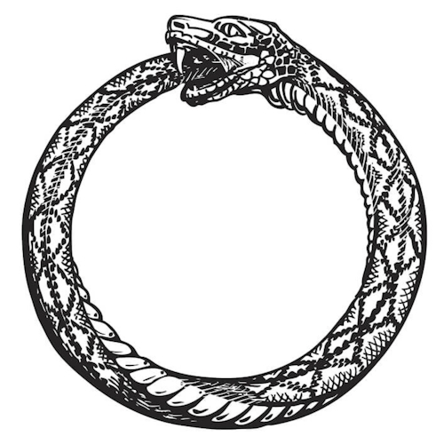
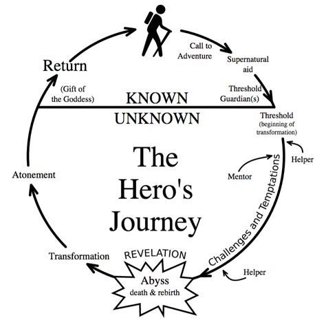

# The Descent into Buddhism

## Who am I, what is this article

I always liked mazes as a kid. I particularly liked the challenge of not putting pencil to paper until I had them solved. Seeing how tall I could stack the incorrect paths in my head probably had unintended consequences, since my math teachers always complained that I never showed my work. But really, the fun wasn't in _how_ I solved the problem, it was in the fact that I _did_ solve the problem, and maybe just a bit about being the type of guy who _could_ solve it.

However, starting around college, (coincidentally around the time I was forced to start making my own life decisions) my mind decided to raise a question of a much greater magnitude:

"What is the meaning of life?"

An age old question that, until that point, I had never taken seriously. Some part of my mind had considered that question inoperable, off-limits from actual contemplation. But now, I reasoned:

"If I have to start deciding how I want to live my life, I obviously have to make the right decisions. And if I don't know what's actually meaningful, how am I supposed to make good decisions?"

The question pittered around in the back of my head for a couple of years, and I eventually settled on an answer that suited me just fine: "The meaning of life is to find a meaning in life". I didn't actually land on a specific meaning for myself at the time, but satisfaction at my own recursive prowess kept me placated.

Fast-forward to 2020: Covid hits, I am utterly isolated, and I experience a freak injury that makes sitting painful and prevents me from feeling anything from sex. Fortuitously, one of my friends had recently introduced me to the Waking Up app. And, being the goody two-shoes student I am, instead of drowning my pain in alcohol or food, I turned to investigating the nature of my own experience.

After all, if I was so smart, why wasn't I happy?

Turns out, this rabbit hole was one I wasn't getting out of.

___

The Waking Up app was cool; for the first time ever I got to hear people who seemed similarly interested in peeking below the surface of reality. The app presented a wide range of perspectives and teachings, but most fell short of what I was looking for. I wanted _answers_, damnit.

After listening to the series on Stoicism, I had just about had it. I remember giving my sister my review: "Very solid coping mechanisms for nerds".

But finally, after hitting play on a few of Joseph Goldstein's Buddha Dharma talks, I started realizing something: "Wait, these guys made a _science_ out of subjective experience? And not only is it a science, but it's a _solved_ science? The Buddha just _has_ the answers, and it turns out those answers solve suffering for good?!?" To me, Buddhism was on an entirely different level of insight, practicality, and scientific rigor than any other spiritual, religious, or philosphical framework I'd encountered.

Over the course of the next three years (we are now at the present date), I pieced together a coherent picture of the Buddha's teachings, meditated a bunch, took some illicit substances, accidentally threw my psyche into a state of immense suffering that lasted for 3 months, discovered Rob Burbea (<3), recovered mentally, and worked to reconcile the seemingly indisputable teachings of the Buddha with my own life experience.

___

So back to this article: It's actually going to be three:

1. This one, in which I try to explain the Buddha's most central realizations and what they entail, succinctly but clearly, in fully English terms.
2. An article where I address arguments for and against Buddhism in order to clear up common misconceptions and explain how I currently relate to it.
3. An article where I outline my current beliefs, specifically relating to ontology, meditative practice, and ways to make life better.

Before we begin, a disclaimer: I am not a Buddhist scholar, but I have done my best to emphasize only things the Buddha himself actually taught. I'm intentionally not going to go into arguments against any of his claims here, and I'm also not going to emphasize the nicer aspects of the Buddha's teachings (like the Jhanas & cultivating love and generosity). I want the Buddha's implicit ontology to come through as clearly as possible, and I explicitly don't want to blunt that impact. Please, _PLEASE_ do not take any of this as meditation advice. Instead, stay tuned for article 3 `:)`

## Who the Buddha was

The Buddha (given name: Siddhartha Gautama) was born to royalty. The story goes: Siddhartha's parents sheltered him so he wouldn't be exposed to the painful aspects of life and could instead rule from a position of comfort. However, at the young age of 29, he finally left the palace and bore witness to the suffering of others. Specifically, he saw an elderly person, a diseased person, a corpse, and a wandering ascetic.
Siddhartha realized:

“I am subject to aging, subject to sickness, subject to death, subject to loss. I have not gone beyond aging, sickness, and death."

So, understanding his predicament and hoping to find a spiritual path that would allow him to transcend the suffering of his impermanent existence, Siddhartha followed the lead of the wandering ascetic and left his palace for good. He was an extremely precocious student, quickly mastering the teachings of many spiritual traditions, but found that none of them actually provided a refuge from his suffering. He then decided to take matters into his own hands, investigating the nature of his own experience directly to find a way to eliminate suffering for good.

Finally, six years after striking out on his own, Siddhartha reached full enlightenment, earning the title of "The Buddha" ("The Awakened One"). After his enlightenment, his first recorded words were thus:

“Through countless births in the cycle of existence
I have run, not finding
although seeking the builder of this house;
and again and again I faced the suffering of new birth.
Oh housebuilder! Now you are seen.

You shall not build a house again for me.
All your beams are broken,
the ridgepole is shattered.
The mind has become freed from conditioning:
the end of craving has been reached.”

And if you're curious, these were his last words:

"Behold, O monks, this is my advice to you. All component things in the world are changeable. They are not lasting. Work hard to gain your own salvation."

If it's not clear already, the Buddha's view on life was not exactly happy-go-lucky. From the get-go, he was dead-set on his vision, and he never deviated from it. The Buddha was known to say:

“I teach one thing and one thing only: Suffering and the end of suffering.”

## Buddhism in a nutshell

### The Four Noble Truths

You may have heard the Four Noble Truths before. They are the central teachings of Buddhism, and they go as follows:

1. Suffering is inherent in human life: Physical pain, emotional distress, existential dread, you name it.

2. Suffering has a cause. Namely: Craving and aversion, which arise due to ignorance of the true nature of reality.

3. It is possible to reach the end suffering: Craving and aversion can be abandoned through a deep understanding of reality.

4. The path to ending suffering is the Noble Eightfold Path: Right understanding, intention, speech, action, livelihood, effort, mindfulness, and concentration.

So what is this "true" nature of reality that us plebians are blind to?

### Emptiness and Dependent Origination

"Existence isn't real, but it isn't _not_ real either. 😏"

#### "It" "Is" "Soup"

The primary teaching that Buddhism offers is the realization of Emptiness. Specifically, the emptiness of all phenomena.

In this case, Emptiness does _not_ mean "nothingness"; it's not claiming that nothing exists (and despite the name it's also not endorsing nihilism, but we'll get to that later). Instead, it's a claim that things don't exist in the way we naturally believe they do. When we perceive any "thing", we instantly subconsciously label it, conceiving of it as an independent object that matches the identity we labeled it with.

Is it really soup?

For example, when we have a bowl of hot broth with white meat and pasta in it, we think "this is chicken soup". And it is... right? And it's still soup when you spoon it into your mouth, but then maybe it's not quite soup because there's some saliva mixed in, and then when you swallow it the chicken isn't quite "in" the broth anymore, and everything is mashed up. So it's not soup anymore? And when it's in your stomach, when does it stop being "chicken" and when does it start being "you"? When you can't see it anymore?

It turns out our natural inclination to label things is a lot less about reality and a lot more about usefully categorizing things. If we want to understand reality beyond the labels, the Buddha has an explanation ready to go.

#### Because This Is, That Is

Dependent Origination states that all phenomena are interconnected, only arising dependent on an inconceivably complex web of prior causes and conditions. There is no "thing" that has the sort of inherent, independent, or permanent existence that we tend to subconsciously attribute to phenomena. Additionally, the concept of Interdependent Co-Arising states that not only are all things dependent on other things, but cause and effect necessarily arise together. The teaching of this concept generally goes as follows:

"With this as condition,
That arises.
With this NOT as condition,
That does NOT arise."

At first, these ideas may seem obvious, or at the very least unimportant. Of course things cause other things. But putting some pieces together, we realize a few things:

1. Nothing in our experience is fundamental. Put another way, there is no root cause that is in itself not also an effect of some other cause. It's all interconnected and cyclic. Imagine an Ouroboros (a snake eating its own tail).

2. Every phenomena has a specific set of causes that are conditions for it to arise. If we can remove even one of the causes, the effect will no longer arise.

### SparkNotes: Enlightenment

At this point, we have enough context to describe enlightenment in the most bare-bones possible way. When the Buddha fully awakened, he:

1. Fully realized the Dependent Origination of all phenomena (that things only exist if the cause for them exists)

2. Put together insights that make up the Four Noble Truths (what suffering is, what causes it, and that it can be be ended)

3. Experienced the Emptiness of all phenomena directly (thus seeing the cause of suffering as empty and abandoning it)

4. At which point he became fully enlightened (liberated from suffering and all conditioned phenomena)

And that's great for him. But unless you suddenly awakened after reading that, conceptual understanding is clearly not enough to reach full enlightenment.

Awakening is a directly experienced realization. And just our luck: The Buddha devised some strategies to help people reach that direct experience.

### The Five Aggregates and The Three Characteristics

Seems like the Buddha really liked listicles. That, _or_ maybe it was just easier to remember teachings this way back before everything was recorded or written down. In any case, The Buddha defined these two groups as ways of looking at experience that would lead to the realization of emptiness (AKA un-inherentness).

#### The Five Aggregates

The Buddha encouraged practitioners to view all of experience as a combination of five "aggregates", or "types" of phenomena.

1. Form: Physical sensations; the 5 senses
2. Feeling: The "tone" of sensation; whether something is pleasant or unpleasant
3. Perception: Recognition of sensory objects; automatic/subconscious labelling
4. Mental Formations: Thoughts, emotions, beliefs, stories
5. Consciousness: Awareness, presence

By dividing experience into buckets, it's easier to see that every possible "thing" you can recognize falls into one of those buckets. This makes staying "awake" to phenomena simpler.

For example, if you feel a pain in your knee, you would normally be likely to immediately feel the unpleasantness of it, subsonsciously label it as "knee pain", and immediately be pulled into a story: Maybe about how you got the injury, how long it will take to heal, or how it's otherwise impacting your life.

"I just wanted to grab a snack..."

Looking in terms of the five aggregates is a strategy to break that automatic cycle. When you feel that pain, you notice the sensation as "Form", the unpleasantness as "Feeling", and so on.

The five aggregates view is also depersonalizing: If things are just "aggregates", there's not much reason to care about them. Likewise, all of the aggregates are impermanent, unable to permanently satisfy us in a way we'd like, and can't be inherently identified as "me" or "mine". The Buddha heavily emphasized these three aspects of phenomena in his teachings, going so far as to proclaim them as...

#### The Three Characteristics

In order to end suffering once and for all, drastic measures must be taken. Specifically, adopting lenses that cast experience in the worst possible light.

1. Impermanence: Everything changes, nothing lasts
2. Unsatisfactory (highly contended translation): Phenomena is "a bummer", or "not quite it", or, if you're really hardcore, "suffering"
3. Non-self: No phenomena is "I" or "me" or "mine". That is, there is no agent owning, controlling, or even witnessing phenomena. There is just experience.

Sound a bit... bleak? Maybe this Buddha guy needed a good karaoke night. Or maybe he just _really_ wanted people to awaken at whatever the cost.

There's a quote from him that goes:

"If you could make a deal, that every day for a hundred years, you would be stabbed with one hundred spears in the morning, stabbed again one hundred times at noon, and one hundred more times in the evening, but with a guarantee that at the end of those hundred years you’d gain full awakening, that would be a deal worth taking."

And not only that, but:

“You wouldn’t feel, at the end of those hundred years, that it had been gained with difficulty relative to what had been gained.”

Damn. What is this awakening then, and how is it _that_ good?

### Awakening

I am not yet an awakened being, so it would be a bit ridiculous of me to try to explain what awakening is like, especially given that even awakened people find it nigh impossible to clearly convey what it's like to people who don't already understand. However, I've read a _lot_ about it, and so I'll try to point to some resources that contour the lines around this very real and distinct phenomenon.

Technically, in Buddha Dharma, there are four stages of awakening, defined by ten fetters that must each be broken to reach full liberation, but for our purposes we'll just go with the first stage. This initial awakening, known as "stream entry", is what most people are referring to when you hear the word "enlightenment".

#### Stream Entry

Awakening, stream entry, nonduality, pure being. Many ways to put it, but it comes down to one key point:

You pay close enough attention to experience in a specific way, and suddenly you realize that there is no "self", and there never was one.

And that's great, actually!

___

Here's an analogy from the Buddha, told to a monk named Magandiya:

Magandiya, it is just as if there were a blind man who couldn’t see black objects, white objects, blue, yellow, red objects, the sun or the moon. Now, suppose that a certain man were to take a grimy, oil-stained rag and fool him, saying, “Here, my good man, is a white cloth – beautiful, spotless, and clean.” The blind man would take it and wear it.

Then suppose his friends, companions, and relatives took him to a doctor, and the doctor treated him with medicine, purges from above and purges from below, ointments and counter-ointments and treatments through the nose. And thanks to the medicine his eyesight would appear and grow clear. Then together with the arising of his eyesight, he would abandon whatever passion and delight he felt for that grimy, oil-stained rag. And he would regard that man as an enemy and no friend at all, and think that he deserved to be killed.

“My gosh, how long have I been fooled, cheated, and deceived by that man and his grimy, oil-stained rag. ‘Here, my good man, is a white cloth, beautiful, spotless and clean.’” In the same way, Magandiya, if I were to teach you the Dharma, this freedom from dis-ease, this unbinding, and you on your part were to understand that freedom from dis-ease and see that unbinding, then together with the arising of your eyesight, you would abandon whatever passion and delight you felt with regard for the five aggregates for sustenance.

And it would occur to you, “My gosh, how long have I been fooled, cheated, and deceived by this mind, for in clinging it was just form, it was just body that I was clinging to. It was just feeling, just perception, just mental processes, mental formations, just consciousness that I was clinging to. With my clinging as condition, there is becoming, birth, and then ageing and death, sorrow, lamentation, pains, distresses and despairs, all come into play, and thus is the origination of this entire mass of stress.

___

And some external readings/listenings that I've found very illuminating:

- [The best description I've seen of the mental processes that occur leading to stream entry, and the logic by which the brain processes awakening and updates its relationship with phenomena](https://www.lesswrong.com/posts/mELQFMi9egPn5EAjK/my-attempt-to-explain-looking-insight-meditation-and)

- [My favorite descriptive account of the experience of awakening (four pages, navigate at the bottom)](https://www.simplytheseen.com/what-is-awakening.html)

- [A Dharma talk by Rob Burbea on awakening and its place in our modern lives](https://hermesamara.org/resources/talk/2008-03-08-awakening)

After stream entry, assuming a practitioner continues practicing, the stages of awakening continue, freeing the being from more and more of the fetters that bind them to the cycle of existence and nonexistence. Eventually, what is reached is known as full enlightenment, "neither being nor nonbeing", also referred to as...

### The Unborn, The Deathless, Nirvana

What lies at the end of existence?

...

It is not of the five aggregates, and it is not a dependent origination.
It is not formed by causal conditions, and therefore never changes, nor ceases to exist.

From the Buddha:

“And now, monks, I thought: ‘This truth that I have realized is profound, hard to see, hard to understand, pure, peaceful, sublime, beyond the realm of reasoning, subtle, and only the wise can experience it’”

"There is that dimension, monks, where there is neither earth, nor water, nor fire, nor wind; neither dimension of the infinitude of space, nor dimension of the infinitude of consciousness, nor dimension of nothingness, nor dimension of neither perception nor non-perception; neither this world, nor the next world, nor sun, nor moon. And there, I say, there is neither coming, nor going, nor staying; neither passing away nor arising. It is without foundation. It continues not. This, just this, is the end of suffering."

“Where all phenomena cease, there all ways of speaking cease.”
