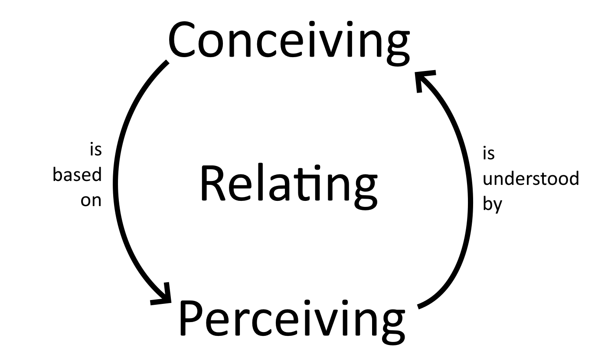

# Ways of Looking

- Desiring (self-preservation, self-gratification, self-love, love for other beings, love for all phenomena, love without object, nondual love, love for image)
- Perceiving (phenomena only experienced as concepts, aware of sensations from the head, sensations aware of themselves, centerless awareness, Jhanas, cessation, imaginal sensations)
- Conceiving (I/me/mine and world, stark nihilism/eternalism, in-between conceptions, five aggregates / three characteristics, emptiness/nonduality, soulmaking/imaginal)

Desires fabricate Perceptions are understood by Conceptions which shape Desires which fabricate... etc.

Valid ways of looking:

- Humans are a result of biological processes built on chemistry, which is built on physics, which is built on math, in a world that started with the Big Bang. There is no reason for this.
- I am a hero tasked with discovering what is important and making it happen
- I was put into this world as a form of punishment
- Everything is just chaos and trying to explain it is futile
- Existence is a cosmic joke; and you can be in on the joke if you just have fun

## Hourglass Analogy

I think of spiritual development like an hourglass. There's only one shared basin, but it's labelled with three different sections: Perceiving, Relating, and Conceiving. Each section has its own hole where sand can be poured into and fall out of, and the depth of your current experience of each is represented by how much sand is in that section. The basin is filled every time you're mindful, speak truthfully, do good deeds (for yourself or others), or meditatate. The basin is emptied whenever your perceptions, conceptions, or relationship to them contracts back to a small self view. Naturally, the exit holes are massive, almost instantly emptying the basin any time it gets filled. But with practice the exits can be made smaller, and we can also more readily and less effortfully pour in new sand.

Since the three sections are undivided, as one section fills, it inevitably begins spilling into the others. Likewise, if one section is emptied, the other sections are pulled down with it. Through the course of our lives, sand will enter and exit the basin countless times. Our experience of life is not a static thing: we never reach a point and permanently settle there. That means that making progress at one time, and then at another being right back to square one, is not only expected, but inevitable. However, the more full the basin is, the more dynamic and joyful our experience and the experience of others will be. The less full, the less joyful. And that's a goal I consider worth striving for.

## Two Kinds of Intelligence

There are two kinds of intelligence: one acquired,
as a child in school memorizes facts and concepts
from books and from what the teacher says,
collecting information from the traditional sciences
as well as from the new sciences.

With such intelligence you rise in the world.
You get ranked ahead or behind others
in regard to your competence in retaining
information. You stroll with this intelligence
in and out of fields of knowledge, getting always more
marks on your preserving tablets.

There is another kind of tablet, one
already completed and preserved inside you.
A spring overflowing its springbox. A freshness
in the center of the chest. This other intelligence
does not turn yellow or stagnate. It's fluid,
and it doesn't move from outside to inside
through conduits of plumbing-learning.

This second knowing is a fountainhead
from within you, moving out.

## Two Ways of Running

A certain man had a jealous wife
and a very, very appealing maidservant.

The wife was careful not to leave them alone,
ever. For six years they were never left
in a room together.
But then one day
at the public bath the wife suddenly remembered
that she’d left her silver washbasin at home.

“Please, go get the basin,” she told her maid.

The girl jumped to the task, because she knew
that she would finally get to be alone
with the master. She ran joyfully.
She flew,
and desire took them both so quickly
that they didn’t even latch the door.

With great speed they joined each other.
When bodies blend in copulation,
spirits also merge.

Meanwhile, the wife back at the bathhouse,
washing her hair, “What have I done!
I’ve set the cotton-wool on fire!
I’ve put the ram in with the ewe!”

She washed the clay soap off her hair and ran,
fixing her chador about her as she went.

The maid ran for love. The wife ran out of fear
and jealousy. There is a great difference.

The mystic flies moment to moment.
The fearful ascetic drags along month to month.

But also the length of a “day” to a lover
may be fifty thousand years!

You can’t understand this with your mind.
You must burst open!

Fear is nothing to a lover, a tiny piece of thread.
Love is a quality of God. Fear is an attribute
of those who think they serve God, but who are actually
preoccupied with penis and vagina.

You have read in the text where They love him
blends with He loves them.
Those joining loves
are both qualities of God. Fear is not.

What characteristics do God and human beings
have in common? What is the connection between
what lives in time and what lives in eternity?

If I kept talking about love,
a hundred new combinings would happen,
and still I would not say the mystery.

The fearful ascetic runs on foot, along the surface.
Lovers move like lightning and wind.
No contest.
Theologians mumble, rumble-dumble,
necessity and free will,
while lover and beloved
pull themselves
into each other.

The worried wife reaches the door
and opens it.
The maid, disheveled, confused, flushed
unable to speak.
The husband begins his five-times prayer.

The wife enters this agitated scene.
As though experimenting with clothes,
the husband holds up some flaps and edges.

She sees his testicles and penis so wet, semen
still dribbling out, spurts of jism and vaginal juices
drenching the thighs of the maid.
The wife slaps him
on the side of the head,
“Is this the way
a man prays, with his balls?
Does your penis
long for union like this?
Is that why
her legs are so covered with this stuff?”

These are good questions
she’s asking her “ascetic” husband!

People who renounce desires
often turn, suddenly,
into hypocrites!

From the translations of Rumi by Coleman Barks
