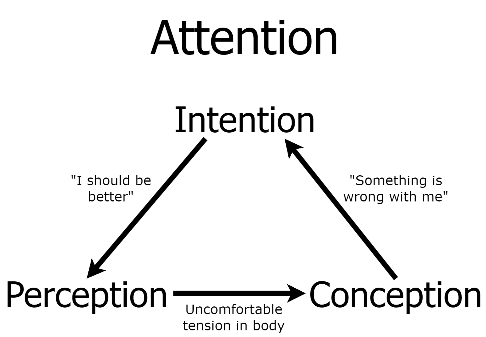

# Sensing with Soul

At this point, the previous sections have given a general overview of Buddhism and some practical arguments for and against it. I personally had issues following the path as I understood it, but it could easily be argued that I simply didn't "fully" understand it. But if that's a possible (and extremely common) pitfall, perhaps there's a better way to reach the goal? And what _is_ the goal, anyway?

## The most important principles

- Beginner's Mind: If all else fails, foget everything you know and see where it takes you.
- Reality is what you believe it is.
  - Middle way of reality: Neither objective nor subjective
  - Shaped by external forces _and_ the actions you take
- Increasing well-being is possible
  - Feeling good / being happy is not a permanent state
    - If you pay attention to your actual life experience, you will realize that no state, good or bad, is permanent
  - Well-being is also not zero-sum. Some people are net positive happiness over the course of their lives, and other people are net negative
- All beliefs are empty & dependently originating
  - The only time to interpret a belief or story is in the present moment
  - Any given narrative doesn't have a real existence, so check whether your narratives are actually helpful
- You have the power to shape the reality you want to live in
  - Extreme Ownership: If you feel badly, look for what you can do to handle the problem (even if it's not your fault).
  - Be your own researcher: "Right now, what is helpful?"
- Move towards what you do want instead of away from what you don't
  - Motivations: Goals (I want to do this) are "towards", expectations (I need to do this OR ELSE) are "away"
  - Pay close attention to what is actually going through your head on a daily basis
    - Both your internal monologue AND the text/music/videos/etc. your senses are ingesting
  - Everything is always shaping your perceptions, conceptions, and intentions, and those are all shaping each other
- How to know what to move towards?
  - "Sensing with soul" is a skill that can be developed
    - Take your whole being into account: Logic (Logos), Desires (Eros), and Spirit/Will to Excel (Thumos)
  - Middle way of desire: Neither what you "want" to do, nor what you "should" do
    - Similar to the Buddha's Middle Way: Neither self-gratification nor self-mortification
  - If you don't know what is helpful, you have no option but to try new things
- Trying new things is a balancing act
  - Our minds naturally move towards what we know will bring us happiness: local maxima
  - It's also very likely that there is a greater happiness if we try new things: absolute maxima
  - One idea: enjoy the local maxima to the fullest (i.e. "make every moment count") but to not be afraid in our search for the absolute maximum (i.e. "follow your truth")
- Again: Reality is something that can be shaped

- I believe everything the Buddha realized and taught about experience was true, but I specifically want to divide the things he said into three categories:

1. Conceptual Teachings
2. Ways of Looking
3. Personal Stances

- Buddhism's conceptual teachings are useful across the board. Understanding "objective" facts is great as long as those facts don't lock you in to a certain mode of thinking. Luckily, Emptiness and Dependent Origination are specifically designed to be concepts that lead to their own unbinding in addition to the unbinding of all other modes of conceptualizing.
- Ways of Looking should _not_ be reified as objective facts. Instead, things like The Five Aggregates and The Three Characteristics are like pairs of glasses you can put on and take off at will. The point of different Ways of Looking is to practice with and recognize the malleability of perception: experience is not _really_ this or that way, but can be shaped in ways that are more or less helpful.
- Personal Stances are just that: entirely personal. They have no bearing on "objective" reality, nor should they be used as a teaching mechanism to influence what people believe or practice. The Buddha, after the experience of his entire life (and lives before that if you believe in reincarnation), decided that the ultimate goal was to reduce suffering, and he found that going beyond existence and nonexistence was the best way to do that. His goals are not your goals. If any person looks deep inside and determines that reducing suffering is the _most_ important thing to them, they may have the same goal. But almost every human is unique, so their personal stances, and therefore their goals, will all be unique.

### Ways of Looking

Valid ways of looking:

- Humans are a result of biological processes built on chemistry, which is built on physics, which is built on math, in a world that started with the Big Bang. There is no reason for this.
- You are a hero tasked with discovering what is important and making it happen
- You were put into this world as a form of punishment
- Everything is just chaos and trying to explain it is futile
- Existence is a cosmic joke; and you can be in on the joke if you just have fun

### Another Way of Looking: Soulmaking

- If all ways of looking are empty, why not pick one up that aligns with your deepest goals and values?
- General direction: Movement towards more attention on love / less on safety
- Where to start: Move from self-preservation -> self-gratification -> self-love
  - Practice: Pay attention to what you're paying attention to (mindfulness) to notice where you're stuck in fear-based mindsets
  - Work: Spend time working towards the cool things you quietly dream of doing. Even if nothing comes of it, you're building an important sense of agency
  - Figure out how to feel love: [This article](https://sashachapin.substack.com/p/how-i-attained-persistent-self-love) by Sasha Chapin is a great starting point, and he also offers a course specifically on self-acceptance
  - Reconnect with your physical being: [The Somatic Resonance course](https://www.riverkenna.com/soma) by River Kenna is great (and he's doing great work so support him if you feel so inclined)
- How to grow: Curiosity, sensitivity, responsiveness, and experimentation

## Attention, and how self-improvement _actually_ works

Our experience is an ever-evolving process. In some ways this is obvious to us: Eating unhealthily will cause compounding health issues over time, working out consistently will make us more fit, and so on. But in many ways, particularly in reference to self-view and our view of others, we conceive of people as static entities. This person is X, they have Y personality, and my relationship with them is Z. This doesn't just apply to external things like people and objects, but to all phenomena. The concepts of Emptiness and Dependent Origination are actually extremely generalizable to our lives, even without hundreds or thousands of hours of meditation and spiritual inquiry.

- Intention (self-preservation, self-gratification, self-love, love for other beings, love for all phenomena, love without object, nondual love, love for image)
- Perception (phenomena only experienced as concepts, aware of sensations from the head, sensations aware of themselves, centerless awareness, Jhanas, cessation, imaginal sensations)
- Conception (I/me/mine and world, stark nihilism/eternalism, in-between conceptions, five aggregates / three characteristics, emptiness/nonduality, soulmaking/imaginal)

## Rumi

From _The Essential Rumi_, translated by Coleman Barks:

## Two Kinds of Intelligence

There are two kinds of intelligence: one acquired,
as a child in school memorizes facts and concepts
from books and from what the teacher says,
collecting information from the traditional sciences
as well as from the new sciences.

With such intelligence you rise in the world.
You get ranked ahead or behind others
in regard to your competence in retaining
information. You stroll with this intelligence
in and out of fields of knowledge, getting always more
marks on your preserving tablets.

There is another kind of tablet, one
already completed and preserved inside you.
A spring overflowing its springbox. A freshness
in the center of the chest. This other intelligence
does not turn yellow or stagnate. It's fluid,
and it doesn't move from outside to inside
through conduits of plumbing-learning.

This second knowing is a fountainhead
from within you, moving out.

## Two Ways of Running

A certain man had a jealous wife
and a very, very appealing maidservant.

The wife was careful not to leave them alone,
ever. For six years they were never left
in a room together.
But then one day
at the public bath the wife suddenly remembered
that she’d left her silver washbasin at home.

“Please, go get the basin,” she told her maid.

The girl jumped to the task, because she knew
that she would finally get to be alone
with the master. She ran joyfully.
She flew,
and desire took them both so quickly
that they didn’t even latch the door.

With great speed they joined each other.
When bodies blend in copulation,
spirits also merge.

Meanwhile, the wife back at the bathhouse,
washing her hair, “What have I done!
I’ve set the cotton-wool on fire!
I’ve put the ram in with the ewe!”

She washed the clay soap off her hair and ran,
fixing her chador about her as she went.

The maid ran for love. The wife ran out of fear
and jealousy. There is a great difference.

The mystic flies moment to moment.
The fearful ascetic drags along month to month.

But also the length of a “day” to a lover
may be fifty thousand years!

You can’t understand this with your mind.
You must burst open!

Fear is nothing to a lover, a tiny piece of thread.
Love is a quality of God. Fear is an attribute
of those who think they serve God, but who are actually
preoccupied with penis and vagina.

You have read in the text where They love him
blends with He loves them.
Those joining loves
are both qualities of God. Fear is not.

What characteristics do God and human beings
have in common? What is the connection between
what lives in time and what lives in eternity?

If I kept talking about love,
a hundred new combinings would happen,
and still I would not say the mystery.

The fearful ascetic runs on foot, along the surface.
Lovers move like lightning and wind.
No contest.
Theologians mumble, rumble-dumble,
necessity and free will,
while lover and beloved
pull themselves
into each other.

The worried wife reaches the door
and opens it.
The maid, disheveled, confused, flushed
unable to speak.
The husband begins his five-times prayer.

The wife enters this agitated scene.
As though experimenting with clothes,
the husband holds up some flaps and edges.

She sees his testicles and penis so wet, semen
still dribbling out, spurts of jism and vaginal juices
drenching the thighs of the maid.
The wife slaps him
on the side of the head,
“Is this the way
a man prays, with his balls?
Does your penis
long for union like this?
Is that why
her legs are so covered with this stuff?”

These are good questions
she’s asking her “ascetic” husband!

People who renounce desires
often turn, suddenly,
into hypocrites!

## Where to now, St. Peter?

Rob Burbea's final talk, given weeks before he died in 2020, is less than five minutes long. I listen to it as a yearly tradition on Christmas Eve.

It speaks for itself: [Perfection and Christ's Blessing](https://hermesamara.org/resources/talk/2020-03-06-perfection-and-christs-blessing)
