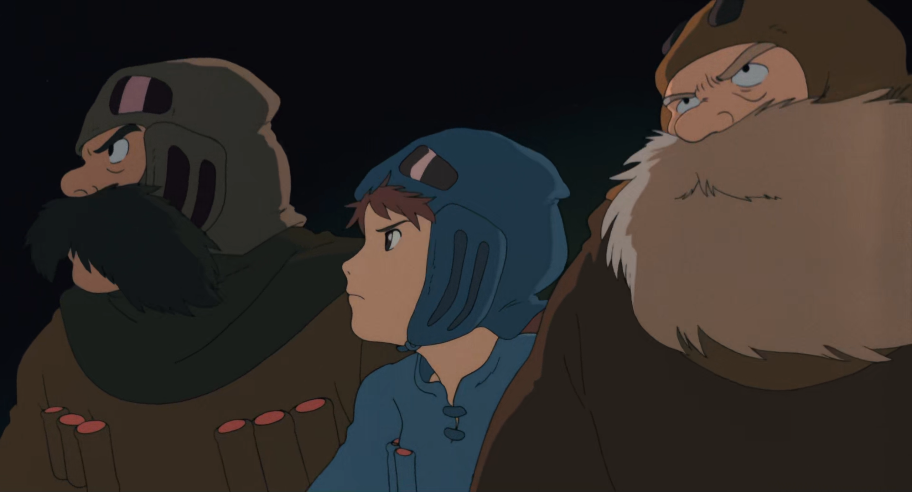
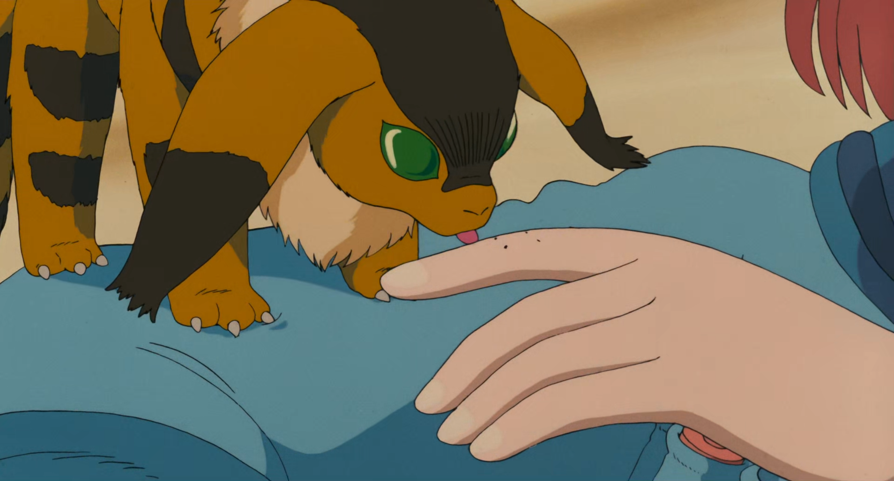

# On Being Human

Why are Studio Ghibli films so good?

I was watching Nausicaa of the Valley of the Wind the other day. It's one of Miyazaki's first films (1984), and yet it's commonly still referred to as one of the best animated films ever made. If you watch it, it's blindingly obvious what makes it so special.

When's the last time you saw someone being brave?

To be brave, you have to know pain is coming, and still do the thing anyway. And there are only two reasons people will do that. Out of fear, or out of love.

"See? Nothing to fear."

Nausicaa is the quintessential idealist: She probably risks her life about 50 times over the course of the movie, and with so little self-concern that it's almost funny. Watching it, I caught myself thinking: "Man, if only anyone was like this in real life".

Why aren't people like this in real life? Why aren't _I_ like this in real life?

Because: It's scary.

___

I've had some health problems in the past few years. Specifically, an injury to my psoas (brought about by a psychedelic venture in which I flexed the muscle in a way it really didn't enjoy) has made sitting painful in addition to preventing me from feeling anything from sex.

As any 20-something male would do, I tried to fix the problem by any means necessary:

Physical therapy, doctors, X-rays, MRIs...

Acupuncture, yoga, chiropractors...

Trying...

Waiting...

Losing hope,

losing meaning,

finding Buddhism.

## The Path of Fear

Have you heard of "temporary Buddhists"? When somebody's closest loved ones pass away, they may suddenly get interested in Buddhism for a few weeks or months. Basically, in the face of inconsolable grief, people are forced to face their suffering directly, and their perspective on life, at least temporarily, matches the Buddha's.

If you aren't familiar with Buddhism already, it's basically this: Life inherently has suffering in it, being free from suffering is _the_ most important possible thing (implicit), therefore we should transcend life. By scientifically investigating your own experience, you can see exactly how suffering originates and cut it off at its root.

For me, I was already interested in the science of experience. Like, how could I be in this life and _not_ try to solve it from the inside out? So I was already on the path to finding Buddhism, but a little boost of suffering pushed me off the diving board and into the deep end.

___

Buddhism is complex, heavy, and incredibly far out of the realm of most people's normal conception of existence. Just hearing about it can strike people in unexpected ways. So consider this a disclaimer: **Buddhism warning: Potentially distressing ontology ahead.**

One of the characteristics of existence (according to the Buddha) is "dukkha", which more or less means "suffering". In any moment of existence, the Buddha says that there is some amount of suffering, and the way to be clear about that is to meditate on it.

Turns out, if you practice viewing all phenomena as suffering while under paranoia-inducing substances (looking at you, Delta-8), it's possible to convince your brain that it is "The Truth" (superseding all other truths). And from firsthand experience, I can tell you that the effects of that (with 0 other preparation) are not good. The last few months of 2023 were by far the most miserable I've had in my entire life.

Specifically, what happened for me was a sudden jolt of realization that everything was a trick. All good things, all bad things, every thing that _has_ happened or _will_ happen was just fake, and caring about any of it could only lead to suffering. You know how your brain will drift off into daydreams as soon as you're not focusing on something? Well every time that happened, instead of random thoughts about myself or others or the future or the past, it was just "this is all suffering". The only thing that helped was to clear my mind by meditating, but usually the thought of being alone with my own mind was too overwhelmingly terrifying to allow myself to do even that. For a few weeks after my initial jolt, I could not go to sleep without a light on and some audio playing to try to distract my mind from "The Truth".

There were only two things that really pulled me out of it: Time, and Rob Burbea.

### Rob Burbea

Rob was the resident teacher at Gaia House in England, teaching Buddhist insight meditation (and more) from 2005 to 2015. He recorded dozens of lectures of Buddha Dharma

Here's an excerpt from one of the talks Rob Burbea gave at a [2008 retreat](https://hermesamara.org/resources/talk/2008-12-28-the-meaning-of-refuge):

> One of my teachers, Ajaan Geoff, said the path is based on a sense of fear, which when I first heard it, I was like, "Wow, that's really odd." Actually to have a very alive sense of danger and fear, it's a requirement for refuge. So the Buddha would encourage these kind of reflections, reflections on ageing, reflections on the fact of sickness, reflections on death, reflections on loss, on the inevitable growing separate from what and who we love. This is the nature of things, and so he said one should reflect, "I am subject to ageing, subject to sickness, subject to death, subject to loss. I have not gone beyond ageing, sickness, death." To really reflect on this. And then to reflect further: "I am not the only one subject to ageing, sickness, death, etc. All beings are subject to ageing, have not gone beyond ageing, sickness, death, loss."

[Nick Cammarata: "ah ok I'll save the world, that's special right!"](https://x.com/nickcammarata/status/1741561355264745778?s=20)

"War and courage have done more great things than charity. Not your sympathy, but your bravery hath hitherto saved the victims." - Friedrich Nietzsche, _Thus Spoke Zarathustra_ [1]

Nietzsche[2]:

The higher it’s type, always the seldomer doth a thing succeed. Ye higher men here, have ye not all - been failures? Be of good cheer; what doth it matter? How much is still possible! Learn to laugh at yourselves, as ye ought to laugh!

What wonder even that ye have failed and only half-succeeded, ye half-shattered ones! Doth not - man’s future strive and struggle in you? Man’s furthest, profoundest, star- highest issues, his prodigious powers - do not all these foam through one another in your vessel? What wonder that many a vessel shattereth! Learn to laugh at yourselves, as ye ought to laugh! Ye higher men, oh, how much is still possible! 

And verily, how much hath already succeeded! How rich is this earth in small, good, perfect things, in well-constituted things! Set around you small, good, perfect things, ye higher men. Their golden maturity healeth the heart. The perfect teacheth one to hope. 

References:
[1]: _Thus Spoke Zarathustra_, X. War and Warriors.
[2]: _Thus Spoke Zarathustra_, LXXIII. The Higher Man; 15.
