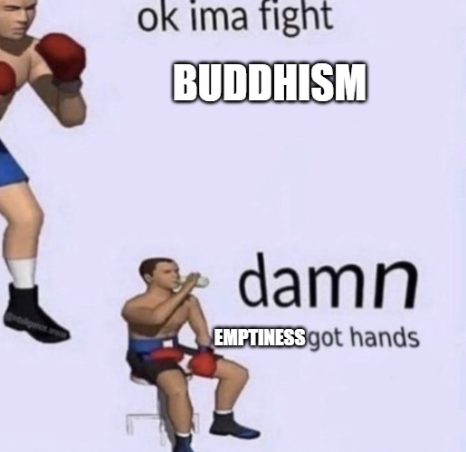

# Extra

## Brass Tacks

There is suffering when there is clinging. Just by being alive, there is some amount of clinging. A person _can_ achieve nirvana and be free of suffering forever.

But what if some suffering is worth it?

Humans suffer when they lack two things: Safety and love. Suffering happens when they don't feel like they have those.

There is no way to _ever_ be safe, if "safety" means "not dying". Likewise, the needs of love are infinitely expanding.

The only way to resolve these needs forever is to remove the need for them (via seeing the emptiness of the self), or even "better", by preventing those needs from ever arising in the first place (by achieving nirvana).

But what do we do before we're there? Or maybe more importantly, what if we don't want to do that at all?

Why not focus on fulfilling those needs directly?

[Carmen on spiritual hygeine](https://x.com/carmenleelau/status/1737631408045408313?s=20)

"War and courage have done more great things than charity. Not your sympathy, but your bravery hath hitherto saved the victims." - Friedrich Nietzsche, _Thus Spoke Zarathustra_ [1]

Nietzsche[2]:

The higher it’s type, always the seldomer doth a thing succeed. Ye higher men here, have ye not all - been failures? Be of good cheer; what doth it matter? How much is still possible! Learn to laugh at yourselves, as ye ought to laugh!

What wonder even that ye have failed and only half-succeeded, ye half-shattered ones! Doth not - man’s future strive and struggle in you? Man’s furthest, profoundest, star- highest issues, his prodigious powers - do not all these foam through one another in your vessel? What wonder that many a vessel shattereth! Learn to laugh at yourselves, as ye ought to laugh! Ye higher men, oh, how much is still possible! 

And verily, how much hath already succeeded! How rich is this earth in small, good, perfect things, in well-constituted things! Set around you small, good, perfect things, ye higher men. Their golden maturity healeth the heart. The perfect teacheth one to hope. 

References:
[1]: _Thus Spoke Zarathustra_, X. War and Warriors.
[2]: _Thus Spoke Zarathustra_, LXXIII. The Higher Man; 15.

## Commmon Threads

Goals:
- Moving away from concepts
- Moving closer to experience: Physical body & emotions

How to get there:
- Direct path

## The Middle Way of Desire

With desire inherently comes clinging. If you have a preference of something, _anything_, you will suffer. Consider these two cases: If you don't have your preference, you will suffer until you get it, and if you _do_ have it, you will suffer in fear of losing it (since all things are impermanent).

If you truly want 0 suffering, the Buddha laid out a very effective path to extinguishing desire.

However, if the meaning inherent in desire is important to you, there's an orientation you can take that minimizes unnecessary suffering (from desires that aren't actually your most important ones).

### Start with Okayness

- Three arrows going up: Need, Want, Should
- Horizontal line of "Okayness" above where the need/should lines curve
- Need: Arrow curves to the left
  - "Things will only be ok if this happens"
- Should: Arrow curves to the right
  - "Things will not be ok unless this happens"
- Want: Arrow going straight up
  - "Things are okay regardless of if this happens, but I am intentionally signing the yearning waiver"
    - BY CHOOSING THIS DESIRE, YOU AGREE TO THE TERMS OF FEELING BOTH SUFFERING AND MEANING

But what if things _aren't_ ok?

### Defeat yourself

Literally. This is the "hard" step. There's no way to move from "not okay" to "okay" without a volitional action,and this is the most direct possible way to do it. There's only one step:

Don't take your own side.

Stop caring about what you have to say about why things aren't okay. If you can do this, things will be okay. If you can't do this, things won't be okay.

This can also be looked at as a selflessness instruction. If you get past the idea of your "self" being a real thing that needs catering to, everything is already okay.

## The most important principles

- Beginner's Mind: If all else fails, foget everything you know and see where it takes you.
- Reality is what you believe it is.
  - Middle way of reality: Neither objective nor subjective
  - Shaped by external forces _and_ the actions you take
- Increasing well-being is possible
  - Feeling good / being happy is not a permanent state
    - If you pay attention to your actual life experience, you will realize that no state, good or bad, is permanent
  - Well-being is also not zero-sum. Some people are net positive happiness over the course of their lives, and other people are net negative
- All beliefs are empty & dependently originating
  - The only time to interpret a belief or story is in the present moment
  - Any given narrative doesn't have a real existence, so check whether your narratives are actually helpful
  - Another way of putting it: We are not inherently "some way". Our minds are just simulation/projection machines built on tautologies. If you act differently than the way "you are", you are now "that way"
- You have the power to shape the reality you want to live in
  - Extreme Ownership: If you feel badly, look for what you can do to handle the problem (even if it's not your fault).
  - Be your own researcher: "Right now, what is helpful?"
- Move towards what you do want instead of away from what you don't
  - Motivations: Goals (I want to do this) are "towards", expectations (I need to do this OR ELSE) are "away"
  - Pay close attention to what is actually going through your head on a daily basis
    - Both your internal monologue AND the text/music/videos/etc. your senses are ingesting
  - Everything is always shaping your perceptions, conceptions, and intentions, and those are all shaping each other
- How to know what to move towards?
  - "Sensing with soul" is a skill that can be developed
    - Takes your whole being into account: Combination of thinking, feeling, and gut instinct
    - Middle way of desire: Neither what you "want" to do, nor what you "should" do
  - If you don't know what is helpful, you have no option but to try new things
- Trying new things is a balancing act
  - Our minds naturally move towards what we know will bring us happiness: local maxima
  - It's also very likely that there is a greater happiness if we try new things: absolute maxima
  - One idea: enjoy the local maxima to the fullest (i.e. "make every moment count") but to not be afraid in our search for the absolute maximum (i.e. "follow your truth")
- The way to hard things is through them
  - Showing yourself that you can live through the hard things is what makes them disappear
  - The fear of the thing is what's causing the problem, not the thing itself
  - Everything that comes up needs to be understood, accepted, and loved, because it's all part of you
- Again: Reality is something that can be shaped

I think teaching Buddhism exactly as the Buddha taught in the modern western world is a terrible idea.

- I believe everything the Buddha realized and taught about experience was true, but I specifically want to divide the things he said into three categories:

1. Conceptual Teachings
2. Ways of Looking
3. Personal Stances

- Buddhism's conceptual teachings are useful across the board. Understanding "objective" facts is great as long as those facts don't lock you in to a certain mode of thinking. Luckily, Emptiness and Dependent Origination are specifically designed to be concepts that lead to their own unbinding in addition to the unbinding of all other modes of conceptualizing.
- Ways of Looking should _not_ be reified as objective facts. Instead, things like The Five Aggregates and The Three Characteristics are like pairs of glasses you can put on and take off at will. The point of different Ways of Looking is to practice with and recognize the malleability of perception: experience is not _really_ this or that way, but can be shaped in ways that are more or less helpful.
- Personal Stances are just that: entirely personal. They have no bearing on "objective" reality, nor should they be used as a teaching mechanism to influence what people believe or practice. The Buddha, after the experience of his entire life (and lives before that if you believe in reincarnation), decided that the ultimate goal was to reduce suffering, and he found that going beyond existence and nonexistence was the best way to do that. His goals are not your goals. If any person looks deep inside and determines that reducing suffering is the _most_ important thing to them, they may have the same goal. But almost every human is unique, so their personal stances, and therefore their goals, will all be unique.

### Ways of Looking

[Aaron Nesmith-Beck on Burbea](https://x.com/anesmithbeck/status/1728204114528698845?s=20)

Valid ways of looking:

- Humans are a result of biological processes built on chemistry, which is built on physics, which is built on math, in a world that started with the Big Bang. There is no reason for this.
- You are a hero tasked with discovering what is important and making it happen
- You were put into this world as a form of punishment
- Everything is just chaos and trying to explain it is futile
- Existence is a cosmic joke; and you can be in on the joke if you just have fun

### Another Way of Looking: Soulmaking

(Just one more framework bro.jpg)
(XKCD competing frameworks)

You don't need a framework, the answer is literally right in front of your nose.

The direct path:

- Everything on this list applies specifically in the moment, not looking back or predicting how things _will_ be
- #1 priority: Be mindful of your revealed intentions (not the ones you tell yourself)
  - Desire, intention, and action, are all actually the same thing. You always act according to your _actual_ desires/intentions, so paying attention to how you're acting reveals your actual underlying intentions
  - How to align stated intentions with revealed intentions? Helpful to think in terms of parts (IFS, MMM). One part of you might say you want something, but another part is resistant.
    - Your parts probably want to protect you from painful feelings/thoughts/memories
    - Having a deep reservoir of love and safety to give to these parts is what will actually allow them to release their protective barriers
- If you feel "wrong", that's where to make changes
  - "Wrong" is specifically _not_ "bad", like pain or grief or anger. Emotions are right, dissonance is not
  - What feels the most scary is usually the thing you need to do.
- How to know what feels "right"
  - Are you able to get into flow state?
  - If you're honest with yourself, does it feel like you're using your gifts well?

- If all ways of looking are empty, why not pick one up that aligns with your deepest goals and values?
- General direction: Movement towards more attention on love / less on safety
- Where to start: Move from self-preservation -> self-gratification -> self-love
  - Practice: Pay attention to what you're paying attention to (mindfulness) to notice where you're stuck in fear-based mindsets
  - Work: Spend time working towards the cool things you quietly dream of doing. Even if nothing comes of it, you're building an important sense of agency
    - How do you know if it's the right kind of work?
      - Wrong: If it's mostly instrumental (e.g. money, status, even something as good as helping others)
      - Right: If it's an art. Does it feel like you're actually expressing your gifts/feelings/truth?
    - Self-belief: If you're rationalizing paranoia about the ways you could fail, you've already lost.
      - Pay attention: Are other people as good at what you're doing as you are?
      - If you work hard enough at anything, you _will_ get good at it. If it's something you actually care about, you will succeed.
  - Reconnect with your physical being: [The Somatic Resonance course](https://www.riverkenna.com/soma) by River Kenna is great (and he's doing great work so support him if you feel so inclined)
  - Figure out how to feel love: [This article](https://sashachapin.substack.com/p/how-i-attained-persistent-self-love) by Sasha Chapin is a great starting point, and he also offers a course specifically on self-acceptance
- How to grow: Curiosity, sensitivity, responsiveness, and experimentation

## Attention, and how self-improvement _actually_ works

Our experience is an ever-evolving process. In some ways this is obvious to us: Eating unhealthily will cause compounding health issues over time, working out consistently will make us more fit, and so on. But in many ways, particularly in reference to self-view and our view of others, we conceive of people as static entities. This person is X, they have Y personality, and my relationship with them is Z. This doesn't just apply to external things like people and objects, but to all phenomena. The concepts of Emptiness and Dependent Origination are actually extremely generalizable to our lives, even without hundreds or thousands of hours of meditation and spiritual inquiry.

- Intention (self-preservation, self-gratification, self-love, love for other beings, love for all phenomena, love without object, nondual love, love for image)
- Perception (phenomena only experienced as concepts, aware of sensations from the head, sensations aware of themselves, centerless awareness, Jhanas, cessation, imaginal sensations)
- Conception (I/me/mine and world, stark nihilism/eternalism, in-between conceptions, five aggregates / three characteristics, emptiness/nonduality, soulmaking/imaginal)

## Buddhism vs. Science

**First of all, how do you categorize Buddhism?**

I think this point is really important, so I'm putting it first.

Buddhism, like religion, philosophy, and science, is a mechanism that tries to convey truth. Take a look at this chart:

|                   | Objective Reality      | Subjective Reality |
|-------------------|------------------------|--------------------|
| Claims of Fact    | Religion               | Buddhism           |
| Theories          | Philosophy             | Scienctific Method |

I can forsee a _lot_ of people looking at this chart and saying "wtf?", so let me clarify some definitions.

- Objective Reality: What is true _outside_ of our experience.
- Subjective Reality: What is true _inside_ of our experience.
- Claims of Fact: Beliefs that are treated as objectively true.
- Theories: Beliefs that aren't treated as objectively true.

Now, how each category matches those definitions:

First, religion: Religion makes claims of fact about objective reality. Religion is clearly not presented as a "theory", nor is it used in practice as one. It's faith-based. Religion is treated as a ground truth that can be depended on, and it explains the reality that exists independently of our conception of it.

Next, the scientific method: This one might be strange to some people, since science is supposed to be _the_ most reliable thing we have to determine what is real. And... I would agree with that. But, according to the actual scientific method: Experimental results, even if replicated a million times, are still theories, not "facts" (objective claims). They _could_ be proven false at any time, they just haven't been yet. Science, when done with integrity, is just "what was done" -> "what happened". The "what happened" bit is not some "objective reality" outside of what we experience. The only thing we know about "what happened" is what we saw/heard/felt/smelled/tasted. AKA: What we experienced. AKA: Our subjective reality.

Next, philosophy: Philosophy, like religion, attempts to describe what reality really is, outside of our subjective experience. Unlike religion though, philosophical claims are intended to be purely rational. And since we, as subjective experiencers, can't possibly verify if a philosophical claim about an objective reality outside of our experience is true, philosophical claims must remain as theories.

Finally, we have Buddhism. The reason it's so hard to categorize is because it's not _quite_ a religion and not _quite_ a science. What do I mean by that? Like the scientific method, Buddhism only deals with things in our subjective experience. It says "practice these things and these results happen". But unlike the scientifc method, it doesn't say "these results _have_ happened, but maybe they could be different". The Buddha said "all phenomena _are_ empty". In doing, so he was making an claim of fact about subjective reality.

### Why Buddhism over [insert religion here]?

As mentioned above, Buddhism isn't really a religion; it's apples to oranges. Religion attempts to declare facts about objective reality, whereas Buddhism declares facts about subjective reality. So it's quite possible to be a Christian Buddhist.

### Are science and Buddhism at odds?

Again, there's no overlap between these two where they even _could_ be at odds. Both the scientific method and Buddhism are based on running verifiable experiments on subjective reality and making claims based on their results. Anyone is free to run the Buddha's experiments of meditative inquiry and come up with different results, but that just hasn't happened yet.

There _is_ a difference between the two though. In science, everything is a "theory": As in, the claims should not be treated as objective fact. On the other hand, the Buddha _does_ makes objective claims.

I think the better question, and the one that most people are _really_ asking when they bring up science and objectivity as an argument against Buddhism, is...

### Are Scientific Materialism and Buddhism at odds?

This is where things get spicy.

Scientific materialism is the belief that objective reality is made of matter; the particles that make up our reality are fundamentally real and cause everything else to work the way it does.

It's important to clarify that scientific materialism is _not_ the same thing as the scientific method, and it's not "the results of the scientic method" either. Scientific materialism takes the theories we've come up with based on scientific experiments run on subjective reality, mixed them with subjective intuitions about how reality works, and claims that the amalgamation is objective reality.

In the chart, scientific materialism would fall under the "religion" category because it's claiming a fact about objective reality. In a sense, scientific materialism is the "religion of no religion", and its followers have a "faith in faithlessness".

As with other religions, there's not technically overlap between scientific materialism and Buddhism. It's very possible to be an athiestic Buddhist, for example.

But, since it'd be fun... why don't we try using the concepts of Buddhism to try to explain objective reality?

### Emptiness as Objective

If we look at modern physics, we can almost intuit emptiness without even knowing about Buddhism. Modern quantum mechanics seems to support the things the Buddha said two and a half millenia ago.

Remember, the fundamental concept underlying Buddhism is Emptiness: That things don't have an actual, inherent existence.

Even going back a hundred years, scientific material was already starting to lose it's footing.

Take Werner Heisenbarg. This was a hundred years ago, and physics has only gotten crazier since:

> What is an elementary particle? We say, for instance, simply “a neutron,” but we can
give no well-defined picture of what we mean by the word. We can use several pictures
and describe it once as a particle, once as a wave or as a wave packet. But we know that
none of these descriptions is accurate…. If one wants to give an accurate description of
the elementary particle … the only thing which can be written down is a probability
function [what I just talked about]. But then one sees that not even the quality of being
[that it ‘is’ or ‘is not’], if it may be called a quality, belongs to what is described.

I'm not a physicist though, so maybe my word doesn't count. But how about Niels Bohr, creator of the Bohr model of the atom and major contributor to quantum theory?

> “Everything we call real is made of things that cannot be regarded as real.”

But Bohr was a bit of a philosopher. Maybe, despite his genius, he was also inclined to believe in some outlandish things. How about someone we can _really_ trust: Albert Einstein.

> "Quantum mechanics is certainly imposing. But an inner voice tells me that it is not yet the real thing. The theory says a lot, but does not really bring us any closer to the secret of the old one. I, at any rate, am convinced that He does not throw dice."

## My Theory on "Why" (Religion)

We already defined suffering as "clinging". Anytime there is a duality, your mind is literally "clinging" to maintain the structure of "this" vs. "that". So another word that I think will clarify some things here is "effort". I think this word does a _way_ more helpful job of categorizing phenomena than "suffering". Phenomena is not objectively bad (remember, all ways of looking are empty), but it does take effort to have any perception at all.

And you know another word for effort? Work.

We cannot escape the trappings of the culture we grew up in. If you live in the western world, Christianity is in your bloodstream whether you like it or not. If I rephrase the Buddha's teachings in a more Christan frame, suddenly they become:

1. There is work to be done
2. There is work to be done because you are a sinner
3. It is possible to be free of sin (e.g. John 3:16 "For God so loved the world that he gave his one and only Son, that whoever believes in him shall not perish but have eternal life.")
4. The path to becoming free of sin is to follow the word of Jesus Christ, to do work in God's name

Do I believe this? Not really.

### Ontology

> When I was in graduate school, I recall hearing “One starts as a materialist, then one becomes
a dualist, then a panpsychist, and one ends up as an idealist”. I don’t know where this comes from, but I think the idea was something like this. First, one is impressed by the successes of science, endorsing materialism about everything and so about the mind. Second, one is moved by problem of consciousness to see a gap between physics and consciousness, thereby endorsing dualism, where both matter and consciousness are fundamental. Third, one is moved by the inscrutability of matter to realize that science reveals at most the structure of matter and not its underlying nature, and to speculate that this nature may involve consciousness, thereby endorsing panpsychism. Fourth, one comes to think that there is little reason to believe in anything beyond consciousness and that the physical world is wholly constituted by consciousness, thereby endorsing idealism.

- David J. Chalmers

Most of us "pick" our ontologies totally unconsciously. Family, friends, school, and society usually push us into believing whatever would be most accepted by our social circle. And it's unfortunate, since Ontology is totally unverifiable, and yet it has an extremely powerful effect on how we live our lives.

To me, ontology is like one of those memes where you pick one based on totally arbitrary criteria. And so, I've created a "What's your Ontology" picker!

Objective reality (Birth Month)...

- Is exactly what we perceive (Materialism) - January / July
- Is both mind and matter (Dualism) - February / August
- Is made of consciousness (Panpsychism) - March / September
- Doesn't exist (Idealism) - April / October
- _REALLY_ doesn't exist (Buddhism) - May / November
- Is all of the above, infinitely and cyclically - June / December

God...

- Doesn't exist
- Is working through you
- Is punishing you
- Is teaching you
- Is you
- Is many different things
- Is just playing it by ear

And the point of it all...

- Doesn't exist
- Is to fulfill your duty
- Is to enjoy it
- Is to suffer
- Is to create and discover
- Is to love and be loved
- Exists but is unknowable

### Paradoxes

- Emptiness of all particles, what's fundamental? Time? Space?

### Provisional Truths

Einstein didn’t disprove Newtonian mechanics so much as identify it as a special case in a more general framework. Whatever future physics is, its first step will be to recreate the predictive power of the Standard Model

Einstein: “while general relativity might one day be superseded, the statistical theory of atoms will never be overthrown.”

[Romeo Stevens on Christianity vs. Buddhism](https://x.com/RomeoStevens76/status/1739807369171972588?s=20)

### FPS, no grabby-grab

Due to the way suffering works, much of our daily suffering can be directly reduced through meditation. Meditative practice

## Blockers

I probably have a solid 500 hours of meditation experience at this point. I've touched the Dark Night through psychedelics, I understand exactly _what_ I'm supposed to be doing when I meditate, but I've yet to see more than an inch or so of progress in my actual meditative skill. Meanwhile, people I know with less than 50 hours of practice are experiencing states of bliss they never thought possible. So what is it that I'm doing wrong?

I did a 10-day Jhourney Jhana retreat in September of last year. As usual, I made basically no progress over the 30 hours of practice. In interviews, the theme that kept coming up was "control". Due to a variety of factors, my default mechanism to get through life is to handle everything by "managing" it. Socially: Manage people's emotions so nobody feels bad. Financially: Manage my money in a way that won't make me feel bad. Exercise: Do it so I won't feel bad (physically, or mentally, about myself). Meditation: I still don't know if there's a "thing" I'm doing wrong, but the only thing my brain feels safe doing is controlling things.

### Benefits of Buddhism

- Never lonely
- Always feel okay
- Better at modeling other people
- Easy to just do stuff
- Way less fear of death
- Can update your beliefs instantly if you want to
- Never bored

## Is the work required to reach stream entry worth it?

[RivalVoices on ending suffering via Buddhism](https://x.com/nosilverv/status/1742311850836951201?s=20)

Who do you believe? If you believe your unawakened self, then almost definitely no. But I'd advise you to consider Plato's [Allegory of the Cave](https://www.youtube.com/watch?v=69F7GhASOdM).

If you listen to any stream enterer, almost all will say that the shift that occurs was the most important event of their lives, bar none. And most will spend the rest of their lives trying to help other people experience the same.

Whether you personally should make the effort can only be a personal decision. Do you desire to try? And speaking of desire...

This is why it's important to ask...

## What is your actual desire?

[Nick Cammarata: "ah ok I'll save the world, that's special right!"](https://x.com/nickcammarata/status/1741561355264745778?s=20)

If Buddhism appeals to you, I think it's important to deeply inquire into why. And that's not coming from a place of judgement, but a place of practicality. If you do not deeply desire the reason you're actually practicing, you not only won't likely get anywhere, but you may end up in a mental state far worse than you began with.

Here are some reasons I can think people would want to engage directly with Buddhist teachings:

- Something about the teachings is true and beautiful to them; something deep within them loves the Dharma
- They are deeply suffering
- They have a background in religion/spirituality/meditation that doesn't see the claims as antithetical to their current ontology
- They have reached the point in their lives where selflessness has naturally overtaken self-interest as their primary motivator
- They are willing to risk it all to understand the nature of reality (me)

If you don't fall into any of these camps, then what?

## What actually feels good?

- Trying my absolute hardest
- Believing in something
- Feeling connected with other people
- Absurd, goofy, and creative things that are nonetheless impactful
- Adrenaline rushes from running while listening to music
- Working through a complex issue

## You

"The Buddha once said, "There are ten questions that a practitioner should ask themselves regularly," and it's a very interesting list. One of them is, "What am I becoming as the days and nights fly past?" (Aṅguttara Nikāya 10:48) It's a pretty serious question! [laughs] In the climate of the inner critic, that kind of questioning becomes impossible -- it's like poison landing in poison. It's impossible to relate to that question with any kind of sense of it opening something or inspiring something, or even finding an honest answer. A whole level of questioning becomes impossible.

Another instance, the Buddha says, "When one hears of someone else achieving a level of awakening or deep insight, one should think, 'Why not me? Why not me?'" (Aṅguttara Nikāya 4:159) How rarely that's the case when the inner critic is operating -- some whole other spiel of story starts going. The Buddha says, "By relying on conceit, I abandon conceit." More often, what happens in terms of questioning is, the questionings kind of contract into a couple of questions, which end up being, for instance, "Am I doing it right? Am I okay?", and/or "What will they think of me? Will they think I'm stupid, weak, lazy, whatever it is?" So what could be a beautiful outpouring of our life energy, this deep capacity to question, actually becomes something that's constricting and strangling us, binding us." - Rob Burbea, [Liberation from the Inner Critic](https://hermesamara.org/resources/talk/2009-09-09-liberation-from-the-inner-critic)

## What is most important?

Instead of seeing "through" the illusion of self, you're seeing "as" not self, which is a way of looking just like seeing "as" the self is. It's not that one is more "real" than the other.

If you want the fullest, deepest, widest, liberation: Ways of looking (Buddha dharma)
If you want to open to the deepest depths of love and desire: Ways of looking (Soulmaking dharma)
If you want the deepest, richest, widest, sense of meaning, beauty, and sacredness: Ways of Looking

What way of looking is happening when those senses are around?
Practicing those ways of looking improves the sense of those things, and opens the possibility of developing those ways of looking further.

At the beginning, _don't_ presuppose the conclusion of emptiness. The goal is not to just know one more thing, and it's not even to "reach" a final way of looking. It's a continuous, experiential and experimental approach to finding what moves life in the directions we find most important.

It's important to be clear on emptiness: Emptiness does not mean that _really_ everything is just a big, empty space, and therefore we should be nihilistic because nothing exists. And Emptiness _also_ doesn't mean that everything is just a process of the five aggregates in time.

Until you have an experienced understanding of emptiness, the conceptual understanding of it should really be of how it functions. That is, via dependent origination. Nothing exists independently of the conditions that brought it about. And applying the Ways of Looking approach teaches us to see how certain conditions (e.g. generosity) result in certain outcomes (more freedom and love). In this way, we learn to see that things are empty, not in the sense that they are nonexistent or meaningless, but that nothing is set in stone.

What the Buddha awakened to was the emptiness of all things. The reason the Buddha taught "suffering and the end of suffering" was because awakening to emptiness _is_ the end of suffering. The way in which we awaken to that can look a billion different ways, but Buddhism, and all of its branches, and anything else that attempts to reach the truth of reality, converge on this point.

In the seeing of emptiness, in _really_ knowing the emptiness of all things, a freedom of the deepest sort is available to us.

- Paying attention to where your attention is, and directing it towards the things you want to see more of

[Rob Burbea on approaching Emptiness](https://hermesamara.org/resources/talk/2011-12-31-this-matter-of-emptiness).

## What other assumptions are buried under this mess?

The absolute best response that I've heard to this whole deal comes from a talk by Rob Burbea from 2014: [Questioning Awakening](https://hermesamara.org/resources/talk/2014-11-12-questioning-awakening). If you have gripes with the way I've addressed (or not addressed) anything here, I can almost guarantee that that this talk will cover them.

“Only put off until tomorrow what you are willing to die having left undone.” - Pablo Picasso

“The only true wisdom is in knowing you know nothing” - Socrates

## Adam's Instructions for Meditation (and Living Well)

### Prerequisites

1. You must love yourself. If you do not love yourself, I recommend Sasha Chapin's [self-acceptance course](https://www.sashachapin.com/self-acceptance-course). If you don't like that idea, then try talking to your friends and family about how they learned to love themselves. I promise you'll get something out of it.
2. You must be able to reside in your body. River Kenna's [somatic resonance course](https://www.riverkenna.com/soma) is designed specifically for that. If you don't like that idea, then I recommend practicing yoga or some other form of exercise or movement where bodily awareness is key.

### Practice

1. Sit down in as comfortable of a position as possible. You should be able to relax _all_ of your muscles and not fall over. If this requires sitting in a chair with a back and armrests, fine. If it requires lying down flat, it's less ideal because it'll be really hard to focus, but also fine.
2. **Important**: Begin with an intention of kindness. You are doing this practice because you love yourself, and because doing the practice will make you feel better. This is not a background, fuzzy thing. Tell your body very clearly: "I am doing this for you" (with love).
3. As you set the intention of kindness, pay attention to how your body reacts. It should relax, and you should be able to place your attention on the feeling of that relaxation.
    - If your body _doesn't_ relax, you aren't loving yourself. Try step 2 again. If you absolutely can't get it to work, go back to step 1 of the prerequisites. This is not optional.
    - If you don't really understand what it means to place your attention on the feeling of relaxation in your body, try imagining what relaxing feels like, and then tune into the "good" feeling of it. If you still aren't clear about how that feels, go back to step 2 of the prerequisites. This is also not optional.
4. Once you have a baseline level of bodily attention, "meditation" begins. The "goal" is to feel as good (read: relaxed) as you possibly can while your attention rests on your body. Don't do anything else. When you get distracted or tense, just notice it when you notice it (you can't control when that happens), and relax your attention back on your body again. The distractions, and I am not just being "nice" here, are literally an important part of the process.
    - If you're new, this is probably a good place to stop, even if you go for 10-20 minutes. A lot of the time, trying too many new things actually has adverse effects.
    - If you constantly get distracted by emotions (frustration, anxiety, guilt) while meditating, you aren't loving yourself. Try step 2 again. If you absolutely can't get it to work, go back to step 1 of the prerequisites. This is not optional.
5. If you're more advanced, or want to try something new, the next step is to take an explicit stance towards the sensations you're paying attention to. Specifically, the stance of "Welcome :)". As sensations in your body arise, notice each one and accept it as much as you possibly can. The reason this is a more advanced technique is because "doing" anything in meditation is counterintuitive. It's very easy to try to welcome everything by paying as MUCH attention to it as possible. If you push your attention directly into sensations saying "YOU ARE A SENSATION. WELCOME TO MY AWARENESS!", your body will _not_ relax, and the meditation will be uncomfortable and annoying. "Welcome :)" is like a feather-light attention; your awareness should gently graze the sensations, sensuously allowing them in to your cozy abode of bodily relaxation. If you can pull this off, "bad" sensations will lose the edge that makes them feel bad.
6. If you're extra advanced, try noticing the shape and size of your field of awareness. When you first start meditating, you might only be able to pay attention to one spot on your body at a time, and that spot might jump around sporadically. But as you progress, you can notice that the feeling of your whole body is already in awarness without having to do anything else. And not only that, but sounds and all of the other senses are there too. And then you might even notice the feeling of "looking" at sensations; a contraction in the back of your head that's always there because you're "paying attention", and you can relax that too. Eventually, your attention will just be equivalent to everything in the field of awareness.

### Bringing Practice into Life

1. Once you're able to regularly tune into your body and make it feel good in meditation, it's time to tune into your body in real life. Your body always knows _what_ to do, and your head always knows _how_ to do it. When it's safe, instead of relying on your head to decide everything, let the body take charge. Isabel from Mind Mine has [a fantastic post](https://mindmine.substack.com/p/head) on this.
2. You'll know when you're actually letting your body call the shots because doing things will feel _good_. Not just physically, but emotionally as well. You'll feel more confident in the things you're saying and doing, which enables you to do fun stuff, like, say, [writing a tweet like this](https://twitter.com/eigenrobot/status/1747448124396757077).
3. When you're embodied, you feel powerful and in control, and this does _magic_ for your well-being. You feel allowed, maybe for the first time ever, to believe the things you secretly want to believe. For example, I'm fond of [Vivid Void's Ontology](https://x.com/VividVoid_/status/1730709020741386708?s=20).

If you're just beginning meditation, I recommend Rob Burbea's retreat on [Unbinding the Heart](https://hermesamara.org/resources/all/retreat/Unbinding%20the%20Heart). Another world awaits.
